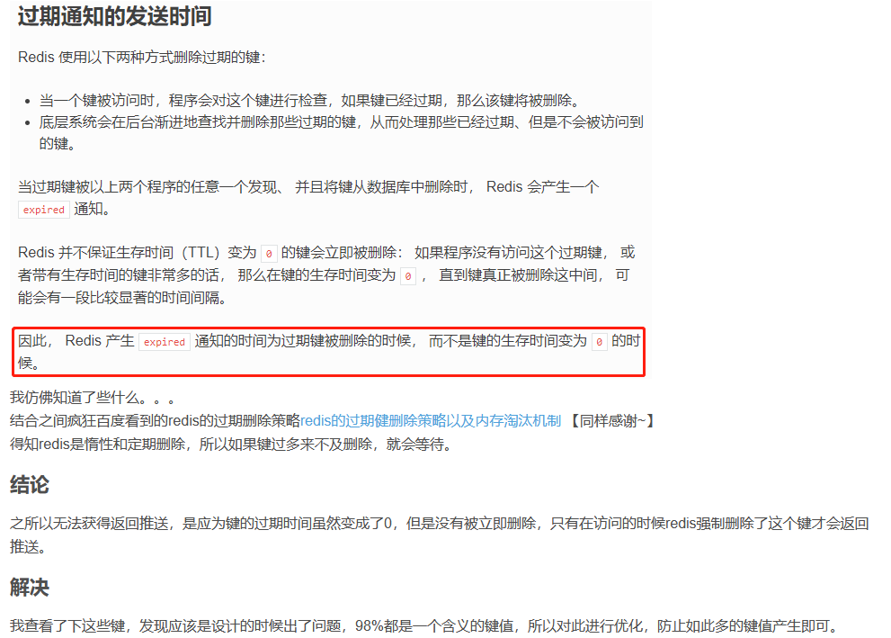

### 1,Jedis有参构造的含义

Jedis构造函数参数的意义：

Jedis(String host, int port, int connectionTimeout, int soTimeout) 

host：Redis节点所在的机器的IP

port：Redis节点的端口

connectionTimeout：客户端连接超时

soTimeout：客户端读写超时

### 2, 项目JedisUtils的原理

以SSM框架模板项目JeeSite为范例，SpringBoot的配置同理，只不过用配置类替代配置文件。

项目中的JedisUtils中的静态变量由IOC容器中的JedisPool赋值, JedisPool的参数由下面的配置文件spring-context-jedis.xml中配置，然后通过jedisPool对象获取jedis对象，即可操作Redis数据库。

```java
public class JedisUtils {
	private static Logger logger = LoggerFactory.getLogger(JedisUtils.class);
	//SpringContextHolder就是获取ApplicationContext对象的包装类
	private static JedisPool jedisPool = SpringContextHolder.getBean(JedisPool.class);
	public static final String KEY_PREFIX = Global.getConfig("redis.keyPrefix");
    public static String set(String key, String value, int cacheSeconds) {
		String result = null;
		Jedis jedis = null;
		try {
			jedis = getResource();  //关键步骤，获取jedis对象，见下面getResource()方法
			result = jedis.set(key, value);
			if (cacheSeconds != 0) {
				jedis.expire(key, cacheSeconds);
			}
			logger.debug("set {} = {}", key, value);
		} catch (Exception e) {
			logger.warn("set {} = {}", key, value, e);
		} finally {
			returnResource(jedis);
		}
		return result;
	}
    
    /**
	 * 获取资源
	 * @return
	 * @throws JedisException
	 */
	public static Jedis getResource() throws JedisException {
		Jedis jedis = null;
		try {
			jedis = jedisPool.getResource();
		} catch (JedisException e) {
			logger.warn("getResource.", e);
			returnBrokenResource(jedis);
			throw e;
		}
		return jedis;
	}
```

SSM框架中的配置redis连接，spring-context-jedis.xml

```xml
<!-- 加载配置属性文件 -->
	<context:property-placeholder ignore-unresolvable="true" location="classpath:jeesite.properties" />
	
	<bean id="jedisPoolConfig" class="redis.clients.jedis.JedisPoolConfig">
		<property name="maxIdle" value="300" /> <!-- 最大能够保持idel状态的对象数  -->
		<property name="maxTotal" value="60000" /> <!-- 最大分配的对象数 -->
		<property name="testOnBorrow" value="true" /> <!-- 当调用borrow Object方法时，是否进行有效性检查 -->
	</bean>

	<bean id="jedisPool" class="redis.clients.jedis.JedisPool">
		<constructor-arg index="0" ref="jedisPoolConfig" />  
		<constructor-arg index="1" value="${redis.host}" />
		<constructor-arg index="2" value="${redis.port}" type="int" />
		<constructor-arg index="3" value="${redis.timeout}"
						 type="int" />
		<constructor-arg index="4" value="${redis.password}" />
	</bean>
```

上面的${}从jeesite.properties中引用值

```properties
redis.keyPrefix=redis
redis.database=5
redis.host=117.73.10.160
redis.port=7777
redis.timeout=7200
redis.password=potevio
```

### 3,Redis过期监听推送功能

(1)过期监听推送功能包含消息订阅发布，监视过期key两个功能，即把即将过期的key推送到后端服务，让后端服务进行数据库内数据的修改。

(2)过期监听推送功能需要在redis.conf文件中进行设置开启

```conf
notify-keyspace-events Ex
```

应用范例：优惠券的过期功能，后台新建一条优惠券数据，保存到数据库的同时也保存到Redis，并设置过期时间，redis中数据将过期时会发布一条消息到后台服务的RedisMessageListener(个人写的)监听器，监听器中进行操作，把数据库内对应的优惠券信息设置为已过期。

(3)**重点**: 慎用

Redis的过期监听的弊端：



(4)具体配置监听器代码如下或网上查询

```java
/**
 * redis过期监听
 * 1、自动取消订单
 * 2、自动收货
 */
@Component
public class RedisKeyExpirationListener implements MessageListener {

	private RedisTemplate<String, String> redisTemplate;
	private RedisConfigProperties redisConfigProperties;
	private OrderInfoService orderInfoService;

	public RedisKeyExpirationListener(RedisTemplate<String, String> redisTemplate,
									  RedisConfigProperties redisConfigProperties,
									  OrderInfoService orderInfoService){
		this.redisTemplate = redisTemplate;
		this.redisConfigProperties = redisConfigProperties;
		this.orderInfoService = orderInfoService;
	}
	@Override
	public void onMessage(Message message, byte[] bytes) {
		RedisSerializer<?> serializer = redisTemplate.getValueSerializer();
		String channel = String.valueOf(serializer.deserialize(message.getChannel()));
		String body = String.valueOf(serializer.deserialize(message.getBody()));
		//key过期监听
		if(StrUtil.format("__keyevent@{}__:expired", redisConfigProperties.getDatabase()).equals(channel)){
			//订单自动取消
			if(body.contains(MallConstants.REDIS_ORDER_KEY_IS_PAY_0)) {
				body = body.replace(MallConstants.REDIS_ORDER_KEY_IS_PAY_0, "");
				String[] str = body.split(":");
				String wxOrderId = str[1];
				TenantContextHolder.setTenantId(str[0]);
				OrderInfo orderInfo = orderInfoService.getById(wxOrderId);
				if(orderInfo != null && CommonConstants.NO.equals(orderInfo.getIsPay())){//只有待支付的订单能取消
					orderInfoService.orderCancel(orderInfo);
				}
			}
			//订单自动收货
			if(body.contains(MallConstants.REDIS_ORDER_KEY_STATUS_2)) {
				body = body.replace(MallConstants.REDIS_ORDER_KEY_STATUS_2, "");
				String[] str = body.split(":");
				String orderId = str[1];
				TenantContextHolder.setTenantId(str[0]);
				OrderInfo orderInfo = orderInfoService.getById(orderId);
				if(orderInfo != null && OrderInfoEnum.STATUS_2.getValue().equals(orderInfo.getStatus())){//只有待收货的订单能收货
					orderInfoService.orderReceive(orderInfo);
				}
			}
		}
	}
}
```

### 4, Redis在CLI界面动态查看日志

找到redis-cli所在目录，执行： redis-cli  monitor。

注意此命令占用资源，仅供临时查看使用。

### 5, info memory 参数解析

```
> info memory
```

| 指标                      | 含义                                                         |
| :------------------------ | :----------------------------------------------------------- |
| used_memory               | 由 Redis 分配器分配的内存总量，包含了redis进程内部的开销和数据占用的内存，以字节（byte）为单位，即当前redis使用内存大小。 |
| used_memory_human         | 已更直观的单位展示分配的内存总量。                           |
| used_memory_rss           | 向操作系统申请的内存大小，与 top 、 ps等命令的输出一致，即redis使用的物理内存大小。 |
| used_memory_rss_human     | 已更直观的单位展示向操作系统申请的内存大小。                 |
| used_memory_peak          | redis的内存消耗峰值(以字节为单位)，即历史使用记录中redis使用内存峰值。 |
| used_memory_peak_human    | 以更直观的格式返回redis的内存消耗峰值                        |
| used_memory_peak_perc     | 使用内存达到峰值内存的百分比，used_memory/ used_memory_peak) *100%，即当前redis使用内存/历史使用记录中redis使用内存峰值*100% |
| used_memory_overhead      | Redis为了维护数据集的内部机制所需的内存开销，包括所有客户端输出缓冲区、查询缓冲区、AOF重写缓冲区和主从复制的backlog。 |
| used_memory_startup       | Redis服务器启动时消耗的内存                                  |
| used_memory_dataset       | 数据实际占用的内存大小，即used_memory-used_memory_overhead   |
| used_memory_dataset_perc  | 数据占用的内存大小的百分比，100%*(used_memory_dataset/(used_memory-used_memory_startup)) |
| total_system_memory       | 整个系统内存                                                 |
| total_system_memory_human | 以更直观的格式显示整个系统内存                               |
| used_memory_lua           | Lua脚本存储占用的内存                                        |
| used_memory_lua_human     | 以更直观的格式显示Lua脚本存储占用的内存                      |
| maxmemory                 | Redis实例的最大内存配置                                      |
| maxmemory_human           | 以更直观的格式显示Redis实例的最大内存配置                    |
| maxmemory_policy          | 当达到maxmemory时的淘汰策略                                  |
| mem_fragmentation_ratio   | 碎片率，used_memory_rss/ used_memory。ratio指数>1表明有内存碎片，越大表明越多，<1表明正在使用虚拟内存，虚拟内存其实就是硬盘，性能比内存低得多，这是应该增强机器的内存以提高性能。一般来说，mem_fragmentation_ratio的数值在1 ~ 1.5之间是比较健康的。详解 |
| mem_allocator             | 内存分配器                                                   |
| active_defrag_running     | 表示没有活动的defrag任务正在运行，1表示有活动的defrag任务正在运行（defrag:表示内存碎片整理）详解 |
| lazyfree_pending_objects  | 0表示不存在延迟释放的挂起对象                                |