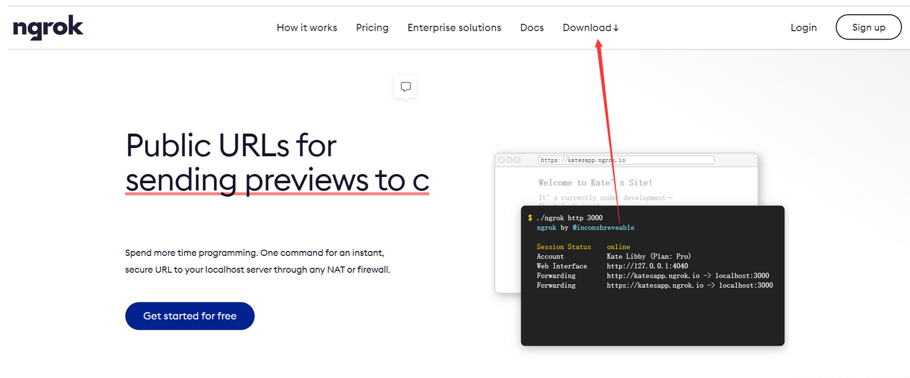
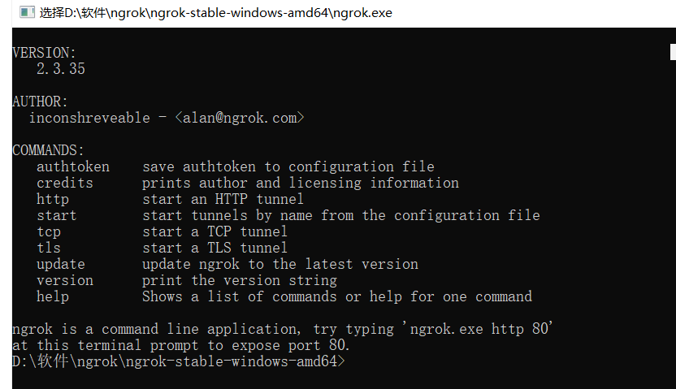

### 最全ngrok实现内网穿透详细教程（windows linux）

https://blog.csdn.net/qq_42978230/article/details/113618902

什么是内网穿透
 内网穿透，也即 NAT 穿透，进行 NAT 穿透是为了使具有某一个特定源 IP 地址和源端口号的数据包不被 NAT 设备屏蔽而正确路由到内网主机。下面就相互通信的主机在网络中与 NAT 设备的相对位置介绍内网穿透方法。
 UDP 内网穿透的实质是利用路由器上的NAT 系统。NAT 是一种将私有（保留）地址转化为合法IP地址的转换技术，它被广泛应用于各种类型 Internet 接入方式和各种类型的网络中。NAT可以完成重用地址，并且对于内部的网络结构可以实现对外隐蔽。
 **应用场景：上面叭叭一大堆，总结一句话就是本地运行的项目，如果不使用内网穿透，只能本机访问。用到了内网穿透，就会给一个公网的ip代替本地ip,这样别人就可以访问到你的本地项目啦。**

用到的工具：
 ngrok 我们可以把他部署到windows上，也可以部署到linux上。接下来让我们来看看这两种应该怎么实现。

**windows上安装**
 a.访问ngrok官网 : https://ngrok.com/



 b.点击下载会Download for windows下来一个安装包 

 c.然后解压.解压出来会出现一个.exe可执行文件 

 d.双击，会出现如下界面（说明已经成功了一大步） 



 e.然后还有一个步骤，就是你需要注册一个ngrok的账号来获取属于你的密钥 


 f.你可以使用你的github账号登录，在这里就不演示了。成功之后，你就可以在主页看到你的密钥。复制下来 

g.然后再刚才的命令行中执行如下命令（2CZJkTcaAAXzRJx53AnD_6aVs8BBAaybUUpSMaaa 这一串数字需要换成你自己的密钥）

```java
ngrok authtoken 2CZJkTcaAAXzRJx53AnD_6aVs8BBAaybUUpSMaaa
```

h:执行成功后，命令行界面中会出现下面的信息。此时，代表配置成功。ngrok程序已经在你的用户目录下，创建一个.ngrok2文件夹，并在文件夹中创建一个配置文件ngrok.yml。

```java
Authtoken saved to configuration file: C:\Users\acer/.ngrok2/ngrok.yml
```

i:在命令行界面中，执行下面命令，即将本地端口80映射到外网中，如果需要映射其他端口，只需将80改成相对应的端口即可。

```java
ngrok http 8080
```

 注意：该程序需一直保持运行，程序关闭，映射也将关闭。如果需要关闭映射，可以使用ctrl + c 或关闭该界面，进行程序终止。每次重新执行命令，映射外网的域名都会发生改变。如果希望域名不变，可通过开通ngrok的会员服务，具体可在官网进行查看。 

**Linux上使用**

 下载下来之后，将压缩包传到您的服务器上（建议创建一个文件夹放进去） 

使用解压命令：

```java
unzip ./ngrok-stable-linux-amd64.zip
```

成功之后会在本文件夹中创建一个ngrok的文件夹（如上图）

然后进行密钥校验（和windows一样）2CZJkTcaAAXzRJx53AnD_6aVs8BBAaybUUpSMaaa需要换成你自己的密钥。

```java
./ngrok authtoken 2CZJkTcaAAXzRJx53AnD_6aVs8BBAaybUUpSMaaa
```

最后进行映射 将本地的8080端口映射。如需要其他的ip,自行更换即可

```java
./ngrok http 8080
```

**如果您需要后台运行：ngrok也是支持的。**
 1.你需要安装screen

```java
yum -y install screen
```

2.安装成功之后，执行

```java
screen  ./ngrok http 8080
```

**成功之后，按下 ctrl +A + D 完成后台ngrok后台运行）** 必须这样操作，不然无效