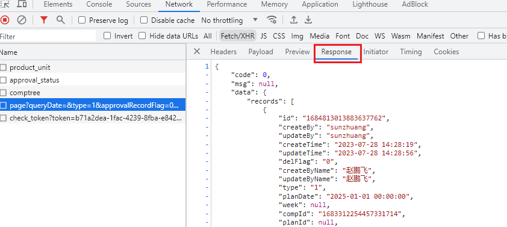

### 一，待定

### 二，Stream获取集合中元素的某一个字段

```java
List<Long> tmIdList = taskCoalList.stream().map(TmTaskCoal::getId).collect(Collectors.toList());
//只获取id的集合
```

### 三，获取网页的页面响应json 格式数据

在浏览器F12控制台的Response里是正确的格式，Preview里不是。



### 四，Java中引用赋值易错点

```java
ProductPlanOutputMain mainPlan = productPlanOutputMain;
//这里把productPlanOutputMain的引用地址给了mainPlan,这两个引用指向同一个对象，如果mainPlan修改属性，那么对象属性就会改变，productPlanOutputMain引用的值同时改变。注意！！
```

### 五，Java实参包装类，调形参基本数据类型报null

```java
Integer i = null;
doSome(i);  //报空指针异常。比较特殊，没有指向被调用的方法。注意。
public void doSome(int number){
    
}
```

### 六，日志框架可System.out的区别？

参考：https://www.baeldung.com/java-system-out-println-vs-loggers

1，适用场景：
System.out和System.err不用引入额外依赖，适用于小型的局部测试。
使用Log4j等日志框架需要引入依赖，但功能全面；

2，日志级别：
System.out/err的只分为两个打印级别，无法满足业务需求。
而日志框架的输出级别分的比较细，适用于多种业务场景。FATAL，ERROR，WARN，INFO，DEBUG，TRACE，ALL；

3，输出独立文件：
System.out/err打印日志默认打印在控制台，无法保存为独立的文件以供排查，使用PringStream设置输出到文件也是十分麻烦，无法设置文件大小，当日志过多时就十分麻烦。无法根据业务灵活自定义名称等。
日志框架设置保存独立文件十分方便，只需在log4j.xml等里设置即可，同时可设置日志文件大小，按日期分别保存日志，覆盖旧的日志以节省空间等等。

4，捕捉异常：
e.printStacktrace()也是输出到系统控制台的，跟System.out一样。
这是可使用logger.log(..)捕捉运行时异常，方便排查

```java
try {
    // some code
} catch (Exception e) {
    logger.log("Context message", e);
}
```

5，与外部其它系统交互：
System.out很难做到与其它系统交互；
日志框架则可以发送日志信息到Kafka，ElasticSearch等框架。