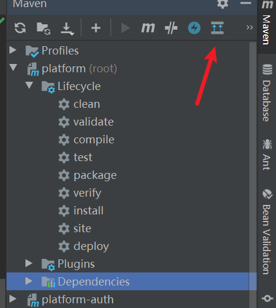

#### 1, Maven配合SSM框架使用时规定各个相关组件的版本
		<properties>
		<!-- main version setting -->
		<spring.version>4.1.9.RELEASE</spring.version>     //Spring框架的版本
		<validator.version>5.2.4.Final</validator.version>
		<mybatis.version>3.2.8</mybatis.version>
		<mybatis-spring.version>1.2.3</mybatis-spring.version>
		<druid.version>1.0.18</druid.version>
		<ehcache.version>2.6.11</ehcache.version>
		<ehcache-web.version>2.0.4</ehcache-web.version>
		<shiro.version>1.2.6</shiro.version>
		<sitemesh.version>2.4.2</sitemesh.version>
		<activiti.version>5.21.0</activiti.version>
		
		<!-- tools version setting -->
		<slf4j.version>1.7.7</slf4j.version>
		<commons-lang3.version>3.3.2</commons-lang3.version>
		<commons-io.version>2.4</commons-io.version>
		<commons-codec.version>1.9</commons-codec.version>
		<commons-fileupload.version>1.3.1</commons-fileupload.version>
		<commons-beanutils.version>1.9.1</commons-beanutils.version>
		<jackson.version>2.2.3</jackson.version>
		<fastjson.version>1.1.40</fastjson.version>
		<xstream.version>1.4.7</xstream.version>
		<guava.version>17.0</guava.version>
		<dozer.version>5.5.1</dozer.version>
		<poi.version>3.9</poi.version>
		<freemarker.version>2.3.20</freemarker.version>
		
		<!-- jdbc driver setting -->
		<mysql.driver.version>5.1.30</mysql.driver.version>
		<oracle.driver.version>10.2.0.4.0</oracle.driver.version>
		<mssql.driver.version>1.3.1</mssql.driver.version>
	    
		<!-- environment setting -->
		<jdk.version>1.8</jdk.version>
		<tomcat.version>2.2</tomcat.version>
		<jetty.version>7.6.14.v20131031</jetty.version>
		<webserver.port>8181</webserver.port>
		<project.build.sourceEncoding>UTF-8</project.build.sourceEncoding>
		<downloadSources>true</downloadSources>
		
	</properties>

#### 2，Maven引入项目中lib本地依赖步骤

以SpringBoot项目为例，设置完成后在打成的jar包里有jna.jar等依赖。

例，pom.xml

```xml
<!--引用本地lib依赖，-->
		<dependency>
			<groupId>com.sun</groupId>
			<artifactId>jna</artifactId>
			<version>3.0.9</version>
			<scope>system</scope>
             <!--这里写${project.basedir}/..报错，原因待查-->
			<systemPath>${pom.basedir}/lib/jna.jar</systemPath>
		</dependency>
		<dependency>
			<groupId>com.sun.jna.examples</groupId>
			<artifactId>examples</artifactId>
			<version>3.0.9</version>
			<scope>system</scope>
			<systemPath>${pom.basedir}/lib/examples.jar</systemPath>
		</dependency>


<build>
		<plugins>
			<plugin>
				<groupId>org.springframework.boot</groupId>
				<artifactId>spring-boot-maven-plugin</artifactId>
				<configuration>
					<includeSystemScope>true</includeSystemScope> <!--要加此行-->
				</configuration>
			</plugin>
    </plugins>    
</build>    
```

#### 3，Maven查看jar包在哪个依赖引入

选好依赖，点击Show dependencies. 在显示图中搜索名称，找到后双击即可跳转到pom文件中引入的位置。



https://blog.csdn.net/song854601134/article/details/130521462

#### 4，Maven打包分离项目和外部依赖

<a href="./note-files/pom.xml">pom配置范例</a>

按照上面配置好之后，因为在pom中已经指定了外部的配置文件和依赖的位置。打成的项目jar包直接用java -jar 启动即可，不用加别的配置参数。

