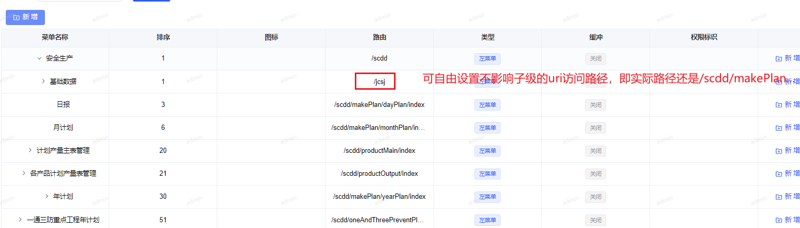
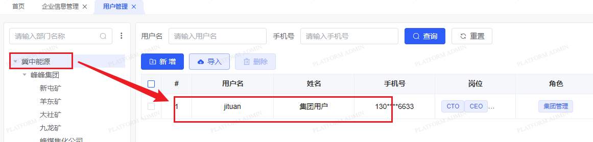
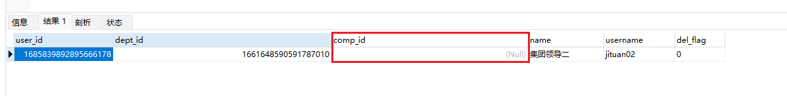

#### 1，菜单的路由设置

菜单路由可自定义设置，不参与拼接访问路径



#### 2，Pig框架权限bug: 

原因：顶级部门下新增用户，保存时不保存comp_id(生产调度项目自定义字段)，导致用户登陆后查询报错

 解决：手动在数据库增加所属部门的comp_id(临时方案)，然后清空下缓存，清除旧的登录数据。





#### 3，Pig5.0开始webSocket

写好websocket页面<a href="Websocket">websocket页面代码范例</a>

.env开启websocket

```js
# 是否开启websocket 消息接受,
VITE_WEBSOCKET_ENABLE = true
```

vite.config.ts也要开启

```javascript
'/api': {
    target: env.VITE_ADMIN_PROXY_PATH, // 目标服务器地址
    ws: true, // 是否启用 WebSocket
    changeOrigin: true, // 是否修改请求头中的 Origin 字段
    rewrite: (path) => path.replace(/^\/api/, ''),
}
```

