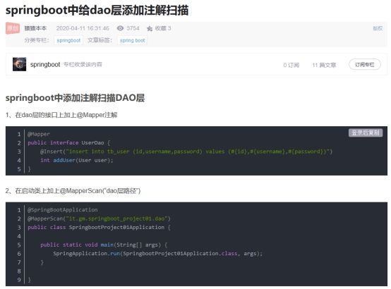

### 一，SpringBoot的配置文件链接数据库注意事项

1，注意dataSource的缩进，级别仅次于spring

2，driver-class-name后面的值要准确，有可能MySQL的驱动不同，包名也不同

3，url的问号后面的设置，useSSL=true，有时需要改为false

```yaml
spring:
  application:
    name: ann-payment
    #配置数据源
  datasource:
    type: com.alibaba.druid.pool.DruidDataSource            # 当前数据源操作类型
    driver-class-name: com.mysql.jdbc.Driver           # mysql驱动包
    url: jdbc:mysql://localhost:3306/ssm?useUnicode=true&characterEncoding=utf8&zeroDateTimeBehavior=convertToNull&useSSL=false&serverTimezone=GMT%2B8
    username: root
    password: 123456
```

### 二，yaml文件配置不同版本MySQL驱动

```yaml
# mysql驱动包, MySQL 5.x版本
driver-class-name: com.mysql.jdbc.Driver           
url: jdbc:mysql://localhost:3306/mybatis_plus?characterEncoding=utf-8&useSSL=false
#对应MySQL 8.x以上版本,8版本以上还要配置时区
driver-class-name: com.mysql.cj.jdbc.Driver 
url: jdbc:mysql://localhost:3306/mybatis_plus?serverTimezone=GMT%2B8&characterEncoding=utf-8&useSSL=false
```

### 三，使用测试注意事项

```java
/**
 * 使用测试类注意事项
 * 1，高版本的SpringBoot(2.2.2以上)测试类要和主启动类的包路径相同，只导入spring-boot-starter-test依赖就行，不用导入junit依赖；
 * 2，注意@Test引入的包的路径，不是junit(import org.junit.Test;),而是springboot的（import org.junit.jupiter.api.Test）
 *   如果不对则会导致@Autowired无法自动注入
 * 3，较旧版本的SpringBoot（例2.1.1）不能用 org.junit.jupiter.api.Test，只能和junit联用，注意版本我呢提
 * */
@SpringBootTest
public class MyBatisPlusTest001 {

    @Autowired
    private UserDao userDao;
}
```

### 四，注意service层自动写的方法，要修改返回值

```java
@Override
    public User getUserById(Long id) {
        //return null;  //idea默认是返回null，注意检查
        return userMapper.getUserById(id);
    }
```


### 五，SpringBoot开启定时任务

1，在主启动类加@EnableScheduling注解；

```java
@SpringBootApplication
@EnableScheduling
public class Application extends SpringBootServletInitializer {}
```

2，在执行定时任务的类上加@Component或@Service都行，表示这是一个组件

```java
@Service
public class DeleteScheduleService {
    private final static Logger logger = LoggerFactory.getLogger(DeleteScheduleService.class);
    @Scheduled(cron="*/5 * 4-22 * * ?")  //
    public void deleteUserNoPay(){
        logger.info("删除过期用户定时任务开始===========>" + DateUtils.getDateTime());
        logger.info("删除过期用户定时任务结束===========>" + DateUtils.getDateTime());
    }
}
```

参考文章：https://cloud.tencent.com/developer/article/1445905

### 六，yml文件里没有配置数据库链接信息报错

报错内容：Failed to configure a DataSource: 'url' attribute is not specified and no embedded datasource could be configured

原因：maven项目的pom.xml里引入了Druid，MySQL等依赖，但是applicaiton.yml里没有配置数据库链接信息，因此报错，如果不需要链接数据库就不要引入这些依赖

### 七，@Cacheable,@CacheEvict的使用

- @Cacheable(value/cacheNames = "缓存名，可以是String数组", key = "键名", unless = "#result==null")
  unless = "#result==null"表示返回值是null时不加入缓存。缓存中找不到的话会执行方法的具体查询语句，所以@CacheEvict不用放在新增方法上。

- @CacheEvict使整个value或cacheNames所指的缓存失效设置方法

  ​    @CacheEvict注意失效方法被同一个类内的方法调用时无法起作用，需用别的类里的方法调用。

-  @Cacheable是基于Spring [AOP](https://so.csdn.net/so/search?q=AOP&spm=1001.2101.3001.7020)代理类，内部方法调用是不走代理的，@Cacheable是不起作用的 

```java
 @CacheEvict(value = CacheConstants.COAL_FILED,key = "#jcCoalFiled.id")
//1,这里指CacheConstants.COAL_FILED缓存中的#jcCoalFiled.id失效，allEntries默认为false，
//2,每次查询，只要没找到key，就会走方法内语句重新查询后，把结果放入缓存
//3,如果key有多个名字拼接成，当查询同一个前缀的时候，后面没参数，就不会走方法的语句查询
// 例，"1:equipment_by_multi_args::1631094382482067457:1:1631179092117839873:null:2"
// 如果查部门1631094382482067457,后面没参数，就不走方法语句。
```

```java
@CacheEvict(cacheNames = CacheConstants.EQUIPMENT_BY_CODE, allEntries = true)
//设置allEntries = true让整个缓存失效，无需指定key属性值。
```


```java
/**
     * 根据 闸机编码获取
     *
     * @param code 闸机编码
     * @return res
     */
    @Override
    @Cacheable(value = CacheConstants.GATE_STATE_BY_CODE, key = "#code", unless = "#result==null")
    public JcGateState getByCode(String code) {
        return lambdaQuery().eq(JcGateState::getEquipmentCode, code).one();
    }

    /**
     *  根据设备编号更新车牌号
     * @param jcGateState
     * @return
     */
    @Override
    @CacheEvict(value = CacheConstants.GATE_STATE_BY_CODE,key = "#jcGateState.equipmentCode")  //更新缓存
    public boolean updateByCode(JcGateState jcGateState) {
        return lambdaUpdate().eq(JcGateState::getEquipmentCode,jcGateState.getEquipmentCode())
                .update(jcGateState);
    }
```

例二

```java
	@Cacheable(value = CacheConstants.COAL_FILED, key = "#id", unless = "#result.data==null")
    public R getById(@PathVariable("id" ) Long id) {
        return R.ok(jcCoalFiledService.getById(id));
    }
	
	//缓存失效机制
	@Operation(summary = "修改煤场表" , description = "修改煤场表" )
	@CacheEvict(value = CacheConstants.COAL_FILED,key = "#jcCoalFiled.id")
    public R updateById(@RequestBody JcCoalFiled jcCoalFiled) {
        return R.ok(jcCoalFiledService.updateById(jcCoalFiled));
    }

    @Operation(summary = "通过id删除煤场表" , description = "通过id删除煤场表" )
    @SysLog("通过id删除煤场表" )
    @DeleteMapping("/{id}" )
    @CacheEvict(value = CacheConstants.COAL_FILED,key = "#id")
    @PreAuthorize("@pms.hasPermission('wrzs_jccoalfiled_del')" )
    public R removeById(@PathVariable Long id) {
        return R.ok(jcCoalFiledService.removeById(id));
    }

```

### 八，@Transactional失效原因

方法被本类内部调用，加了@Transactional注解也不起作用

**原因：**

 spring 在扫描bean的时候会扫描方法上是否包含@[Transactional](https://so.csdn.net/so/search?q=Transactional&spm=1001.2101.3001.7020)注解，如果包含，spring会为这个bean动态地生成一个子类（即代理类，proxy），代理类是继承原来那个bean的。此时，当这个有注解的方法被调用的时候，实际上是由代理类来调用的，代理类在调用之前就会启动transaction。然而，如果这个有注解的方法是被同一个类中的其他方法调用的，那么该方法的调用并没有通过代理类，而是直接通过原来的那个bean，所以就不会启动transaction，我们看到的现象就是@Transactional注解无效。 

```java
public class ProductPlanOutputMainServiceImpl ...{
    @Override
	public R saveOrUpdatePlanBatch(ProductPlanOutputMain productPlanOutputMain) {	
		//调用加本类中事务注解的方法，即使报错也不回滚
        return saveOrUpdateDailyPlan(productPlanOutputMain);
	}
    //加事务注解
    @Transactional(rollbackFor = Exception.class)
	public R saveOrUpdateDailyPlan(ProductPlanOutputMain productPlanOutputMain){
		R r = productPlanOutputMainService.saveOrUpdatePlan(productPlanOutputMain);
		r.setCode(1);
		if(r.getCode() == 1){
			throw new RuntimeException("保存计划失败");
		}
}
```

修改方法，把这个事务方法放到别的类，由Controller直接调用

```java
@Service
public class PlanServiceImpl implements PlanService {
    @Override
	@Transactional(rollbackFor = Exception.class)
	public R saveOrUpdateDailyPlan(ProductPlanOutputMain productPlanOutputMain){
		R r = productPlanOutputMainService.saveOrUpdatePlan(productPlanOutputMain);
		r.setCode(1);
		if(r.getCode() == 1){
			throw new RuntimeException("保存计划失败");
		}
}
```

Controller直接调用

```java
@PostMapping(value = "/savePlan")
    public R saveYearPlan(@RequestBody ProductPlanOutputMain productPlanOutputMain){
		if(DateTypeConstants.DAY.equals(productPlanOutputMain.getType()) || DateTypeConstants.WEEK.equals(productPlanOutputMain.getType())){
			return planService.saveOrUpdateDailyPlan(productPlanOutputMain);
		}
		return productPlanOutputMainService.saveOrUpdatePlanBatch(productPlanOutputMain);
	}
```

### 九，@PostMapping等不写uri如何调用

@PostMapping，@PutMapping, @DeleteMapping等不写uri，默认来对应的请求类型访问对应注解所在方法。

```java
@RequestMapping("/category" )
public class ProductCategoryController {
    
    @PutMapping  //这里没写uri则来put请求默认访问此方法
    public R updateById(@RequestBody ProductCategory productCategory) {
        return R.ok(productCategoryService.updateById(productCategory));
    }
}

```


###  十：

### 1, Springboot的DAO层需加相关注解

注意启动类要加@MapperScan

 

**总结**@Mapper 一定要有，否则 Mybatis 找不到 mapper。 @Repository 可有可无，可以消去依赖注入的报错信息。 @MapperScan 可以替代 @Mapper。 @Component 和 @Repository 效果都是一样的，只是为了声明为bean

### 2,  DOS窗口指定端口和项目访问根路径

| java   -jar    springboot004-1.0-SNAPSHOT.jar  --server.port=8088   --server.context-path=/list |
| ------------------------------------------------------------ |

这里设置的优先级高于配置文件的优先级

### 3,如果部署SpringBoot项目，自定义端口要记得Linux设置防火墙例外

   firewall-cmd --zone=public --add-port=8088/tcp --permanent
   firewall-cmd --reload
   firewall-cmd --zone=public --list-port

### 4, @ConfigurationProperties用法

除了和@Component联用以外，还可以和@Bean联用

```java
@Configuration
public class DruidConfig{
    @Bean
    @ConfigurationProperties("spring.datasource.druid.master")     //这个@ConfigurationProperties给形参druidPropertries注入值
    public DataSource masterDataSource(DruidProperties druidProperties){
        DruidDataSource dataSource = DruidDataSourceBuilder.create().build();
        return druidProperties.dataSource(dataSource);
    }
    /*注意下文的@ConditionalOnPropetries注解用法，
    havingVaule和name属性联用，当havingValue的值和name的值enabled对应的值相同时才加载配置，即havingValue="true", 配置文件中enabled="true" 
    参考：https://www.cnblogs.com/secbro/p/12011522.html
    */
    @Bean
    @ConfigurationProperties("spring.datasource.druid.slave")
    @ConditionalOnProperty(prefix = "spring.datasource.druid.slave", name = "enabled", havingValue = "true")
    public DataSource slaveDataSource(DruidProperties druidProperties)
    {
        DruidDataSource dataSource = DruidDataSourceBuilder.create().build();
        return druidProperties.dataSource(dataSource);
    }
    
}    
```

```yml
application-druid.yml配置文件 
slave:
                # 从数据源开关/默认关闭
                enabled: true
```

