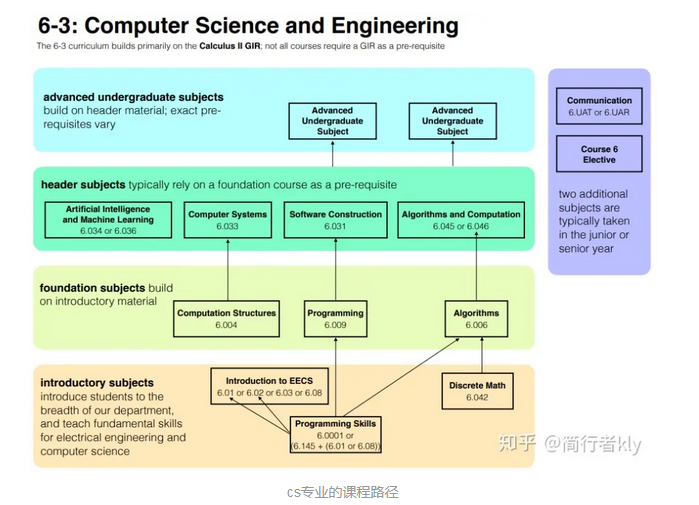

### 如何系统自学cs 计算机科学 （我的mit 挑战） mit公开课[mit ocw] 

众所周知，b站是一个学习网站。只要你也发一条“完结撒花”，那我们就是好同学。但是，这个学习到了，并不是指的是“我收藏了”

今天我就先来讲讲上免费的名校网课：mit公开课 ，因为我一直都在自学计算机，而之前我也试过很多网课，发现mit公开课是最靠谱的方式之一。

**看完这个之后你就会了解，如何完整的，系统的，不花一分钱的学习计算机学科，并且水平还不差**

先说一下我为什么要自学和我怎么走到mit公开课这条路，这样你就了解为什么我说mit公开课的好 。

如果你不想看，可以直接跳到下一标题

一开始我通过跟着知乎微信大v的推书买知识星球学习，结果发现看文字根本啃不动，太硬了，放弃了

后来又想着上couresra edx 网校，入门确实轻松，但只讲某一方面，没有系统路径，走不下去，但是我学了cs50和 introduce to data analyze，技能有用，但是到不了业内水平。

国内培训班，价格太贵，牌子太多，就业好像也没有那么好，不敢去，放弃了。

然后！我看到了Scott H.Young 一年内自学完 MIT 计算机专业的全部 33 门课程？ mit challenge 然后我发现edx也是mit这个开源精神的大学建立的。

最终我走到了这一步 mit公开课。 他满足我所有的要求，视频易于理解（会英语）；系统全面，整个课程都能找到视频，教材。唯一的不足是没有认证，但是他免费啊，

这个我会通过社区大学学分网课，并计划读研弥补。

#### 所以也就解决了，什么人适合上mit网课：

1想学习知识又不需要认证的人 。

比如我已经是程序员，就想复习复习基础知识。或者大学老师讲不明白 ，我想上神课18.06 。

我学完18.01认为国外大学课程更注重动手能力和基础打造，他就说了，我告诉你这些定理你不用背，也被不过，我把原理告诉你你到时候能推出来就行。

2工作学习需求，需要适应语言的人

啊 上大学要出国了，我先学学课程 还能有字幕，到时候听着不费劲，或者文献全英文，你不得先学习下。

不适合什么人？

觉得大学就是筛选机制 用不上大学知识的人。

因为这东西没证书，没有人上人证。

（出国更适合上**Transferable Credit：**带学分认证的网课，学够了2学期，申请的时候可以waive掉雅思托福）（2学期差不多9分，每分在$600左右）

**mit ocw mit公开课学习指南**

有人说看视频还需要教？专心听不就行了。不是的！

每一门课怎么学，参考书在哪，知识怎么巩固。上完了这门课，下一门上什么，你的，可明白。

很多人在b站看了两节课，结果不会怎么用也不会做题，或者觉得两节课间少了些知识，跟不上，就觉得mit的课程不过如此，其实这都是你缺少了课前作业和课后预习。

**接下来，我就会讲到一门课程怎么学，一门学科怎么学**

西方教育和中方不同的是，国内偏考试导向，重视结果，速度，背诵公式，培养做题家。西方注重推导，启发性，结合实际问题多。当然西方课上内容就会感觉信息量就低，就简单，就需课下花时间做习题去巩固，那么有的课还会有课前阅读，你要先预习才能听懂老师课上讲的。我们以18.01单变量数学为例，讲讲怎么上mit网课

首先看到https://ocw.mit.edu/ 这是官网

​          官网

按课程编号或者关键词可以搜到对应课程

我以现在在学的18.01为例

​          进入课程主页

主页上没啥信息，主要就是介绍下课程是什么，有什么版本

然后看到syllabus教学大纲

​          

有什么基础课的要求，如果没有相应知识的话你会很难听懂。

告诉你这门课用的什么教课书，textbook淘宝咸鱼找找都有

calendar ：reading →视频 →assignments→ exams

**课前阅读，日程表，作业，测试我们一起讲。**

​          

**每门视频前都有课前阅读，课后有作业，几门课后有考试测验，这个需要按照日程表执行，**

最后！有人就问了，唉？这个ocw课程，网站上的视频打不开怎么回事，因为课程都在油管上，你肯定上不了，但是好消息是b站上的搬运工都给咱搬过来了，你直接打上课程编号都能找到

[https://www.bilibili.com/video/BV1mx411S7M3?from=search&](https://www.bilibili.com/read/cv7517809/#);seid=7312136965915481144

还带双语字幕，带劲不。

好了，这样怎么学习一门课就讲完了

自己想学什么专业，不知道什么顺序上课，这里有每一门专业的roadmap

https://firstyear.mit.edu/academics-exploration/major-exploration/major-exploration-major-and-minor-options/major-exploration-course-roadmaps-and-important-links

#### cs专业的课程路径：

然后你就可以通过课程编号来找课程了，

如果时间比较久远不要担心，mit一门课定好之后好几年都用这个版本，所以最近发布的肯定是最新的，SC版是你不需要课本就可以自学的版本，和正常版难度一样，所以有SC版可以学这一版。

总结一下，学习国外实录的网课你找准自己想学的专业。学习每门课程需要看好日程表，先做课前阅读，再看视频，在做课后作业。

**而mit网课有以下优点**

1 名校 /和线下一样

2 上课时间更有灵活性

3 不花钱

**当然缺点也很明显**

1要求外语

2学完官方不承认

当然便宜和承认度是成反比的，国外也有带学分的（**Transferable Credit**）带学分的网课价格贵。

好了，这期自学mit就带大家了解到这里。

后续，价格高的国外承认度高的credit课程（能申请研究生的时候用）， 看大家热情再说。