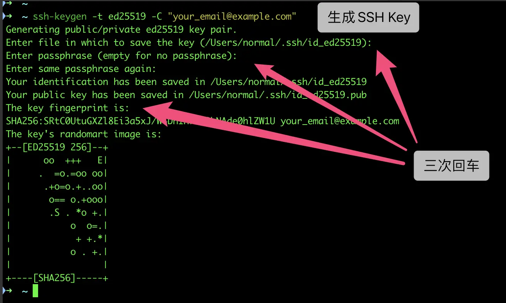

### 1，Git仓库中嵌套子仓库的做法

实际工作中，有可能我的仓库中需要引入另外一个仓库，然后把此仓库提交，保存，推送等。但是，还是向保存原来仓库的特性，让原来的仓库还可以独立运行，这样就需要用到Git的子仓库的功能。

步骤：

(1)在主仓库目录下执行命令，即可把子仓库拉进主仓库里

```console
 git submodule add git@gitee.com:plms/spring-cloud-config.git
 或者
 git submodule add https://gitee.com/plms/spring-cloud-config.git
```

检查命令：

git  status :  

git  diff  --cached   spring-cloud-config :

git  diff  --cached  --submodule

参照：

https://git-scm.com/book/zh/v2/Git-%E5%B7%A5%E5%85%B7-%E5%AD%90%E6%A8%A1%E5%9D%97

(2)将子仓库拉到主仓库后，不用add，直接提交，推送即可

git  commit  -am  "add submoduel  config"

git  push  -u origin  master

(3) 在别的电脑克隆此仓库，会出现只有子仓库的文件夹，而没有文件，需要执行以下命令才有文件

第一种做法：

git  clone  git@gitee.com:plms/spring-cloud-config.git : 执行完子目录没有文件

git  submodule   init :  初始化子仓库

git  submodule   update  :  更新子仓库，注意此时是子仓库内文件当初主仓库提交子仓库时的版本，如需更新最新版的子仓库，还是要到子仓库目录下执行 git  pull  origin  master

第二种做法：

 git  clone  git@gitee.com:plms/spring-cloud-config.git : 执行完子目录没有文件

git submodule update --init --recursive 

第三种做法：

在拉去主仓库时加以下选项

```console
git clone --recurse-submodules  git@gitee.com:plms/spring-cloud.git（主仓库）
```


###  2，生成/添加SSH公钥 ，部署

 [SSH Key](https://gitee.com/help/labels/19) [SSH 公钥](https://gitee.com/help/labels/29) 

Gitee 提供了基于SSH协议的Git服务，在使用SSH协议访问仓库之前，需要先配置好账户/仓库的SSH公钥。

你可以按如下命令来生成 sshkey:

```
ssh-keygen -t ed25519 -C "xxxxx@xxxxx.com"  
# Generating public/private ed25519 key pair...
```

> 注意：这里的 `xxxxx@xxxxx.com` 只是生成的 sshkey 的名称，并不约束或要求具体命名为某个邮箱。
> 现网的大部分教程均讲解的使用邮箱生成，其一开始的初衷仅仅是为了便于辨识所以使用了邮箱。

按照提示完成三次回车，即可生成 ssh key。通过查看 `~/.ssh/id_ed25519.pub` 文件内容，获取到你的 public key

```
cat ~/.ssh/id_ed25519.pub
# ssh-ed25519 AAAAB3NzaC1yc2EAAAADAQABAAABAQC6eNtGpNGwstc....
```




复制生成后的 ssh key，通过仓库主页 **「管理」->「部署公钥管理」->「添加部署公钥」** ，添加生成的 public key 添加到仓库中。


添加后，在终端（Terminal）中输入

```
ssh -T git@gitee.com
```

首次使用需要确认并添加主机到本机SSH可信列表。若返回 `Hi XXX! You've successfully authenticated, but Gitee.com does not provide shell access.` 内容，则证明添加成功。


添加成功后，就可以使用SSH协议对仓库进行操作了。

##### 仓库公钥和可部署公钥

为了便于用户在多个项目仓库下使用一套公钥，免于重复部署和管理的繁琐，Gitee 推出了「可部署公钥」功能，支持在一个仓库空间下使用当前账户名下/参与的另一个仓库空间的部署公钥，实现公钥共用。

### 3，git删除本地分支，远程分支

```shell
删除本地分支：git branch -d 分支名称
强制删除本地分支：git branch -D 分支名称
删除远程分支：git push origin --delete 分支名称

```

