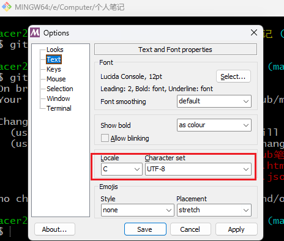

### 1，Git仓库中嵌套子仓库的做法

实际工作中，有可能我的仓库中需要引入另外一个仓库，然后把此仓库提交，保存，推送等。但是，还是向保存原来仓库的特性，让原来的仓库还可以独立运行，这样就需要用到Git的子仓库的功能。

步骤：

(1)在主仓库目录下执行命令，即可把子仓库拉进主仓库里

```console
 git submodule add git@gitee.com:plms/spring-cloud-config.git
 或者
 git submodule add https://gitee.com/plms/spring-cloud-config.git
```

检查命令：

git  status :  

git  diff  --cached   spring-cloud-config :

git  diff  --cached  --submodule

参照：

https://git-scm.com/book/zh/v2/Git-%E5%B7%A5%E5%85%B7-%E5%AD%90%E6%A8%A1%E5%9D%97

(2)将子仓库拉到主仓库后，不用add，直接提交，推送即可

git  commit  -am  "add submoduel  config"

git  push  -u origin  master

(3) 在别的电脑克隆此仓库，会出现只有子仓库的文件夹，而没有文件，需要执行以下命令才有文件

第一种做法：

git  clone  git@gitee.com:plms/spring-cloud-config.git : 执行完子目录没有文件

git  submodule   init :  初始化子仓库

git  submodule   update  :  更新子仓库，注意此时是子仓库内文件当初主仓库提交子仓库时的版本，如需更新最新版的子仓库，还是要到子仓库目录下执行 git  pull  origin  master

第二种做法：

 git  clone  git@gitee.com:plms/spring-cloud-config.git : 执行完子目录没有文件

git submodule update --init --recursive 

第三种做法：

在拉去主仓库时加以下选项

```console
git clone --recurse-submodules  git@gitee.com:plms/spring-cloud.git（主仓库）
```


###  2，生成/添加SSH公钥 ，部署

 [SSH Key](https://gitee.com/help/labels/19) [SSH 公钥](https://gitee.com/help/labels/29) 

Gitee 提供了基于SSH协议的Git服务，在使用SSH协议访问仓库之前，需要先配置好账户/仓库的SSH公钥。

你可以按如下命令来生成 sshkey:

```
ssh-keygen -t ed25519 -C "xxxxx@xxxxx.com"  
# Generating public/private ed25519 key pair...
```

> 注意：这里的 `xxxxx@xxxxx.com` 只是生成的 sshkey 的名称，并不约束或要求具体命名为某个邮箱。
> 现网的大部分教程均讲解的使用邮箱生成，其一开始的初衷仅仅是为了便于辨识所以使用了邮箱。

按照提示完成三次回车，即可生成 ssh key。通过查看 `~/.ssh/id_ed25519.pub` 文件内容，获取到你的 public key

```
cat ~/.ssh/id_ed25519.pub
# ssh-ed25519 AAAAB3NzaC1yc2EAAAADAQABAAABAQC6eNtGpNGwstc....
```


复制生成后的 ssh key，通过仓库主页 **「管理」->「部署公钥管理」->「添加部署公钥」** ，添加生成的 public key 添加到仓库中。


添加后，在终端（Terminal）中输入

```
ssh -T git@gitee.com
```

首次使用需要确认并添加主机到本机SSH可信列表。若返回 `Hi XXX! You've successfully authenticated, but Gitee.com does not provide shell access.` 内容，则证明添加成功。


添加成功后，就可以使用SSH协议对仓库进行操作了。

##### 仓库公钥和可部署公钥

为了便于用户在多个项目仓库下使用一套公钥，免于重复部署和管理的繁琐，Gitee 推出了「可部署公钥」功能，支持在一个仓库空间下使用当前账户名下/参与的另一个仓库空间的部署公钥，实现公钥共用。

### 3，git删除本地分支，远程分支

```shell
删除本地分支：git branch -d 分支名称
强制删除本地分支：git branch -D 分支名称
删除远程分支：git push origin --delete 分支名称

```

### 4，git强制融合，拉取

强制融合，提交，拉取

```
git merge master --allow-unrelated-histories
git pull origin master --allow-unrelated-histories
```

### 5，设置本地仓库同时提交gitee，github

**前提条件:**两个仓库有相同的公钥。以本地有 gitee仓库，同步到github为例

1，在本地已有的gitee仓库中添加github的仓库:  

```shell
git remote add origin-github git@github.com:NicholasRabbit/datastructure.git
```

2，强制拉取github的仓库到本地，注意github默认分支为main，可修改为master

```shell
git pull origin-github master --allow-unrelated-histories
```

3，本地手动融合好文件后，直接提交到github

```shell
git add -A
git commit -m ""
git push -u origin-github master
```

以上为个人范例，其他参考

https://cloud.tencent.com/developer/article/1774890

https://zhuanlan.zhihu.com/p/346400298

### 6，git查看用户名

显示name的方法：

```
git config user.name
git config --list12
```

或者查看`~/.gitconfig`文件。

### 7，git切换分支注意提交

Git有多个分支的话，在本地其中一个分支的文件做修改，而没有提交的话，别的分支也同步显示该文件的修改，只有提交了，别的分支才不显示

### 8，git查看提交历史

git reflog : 查看简单日志

git log : 查看日志全部信息

git log --oneline : 按行查看提交日志 （**常用，跟idea显示效果一样**）

git log --graph : 使用拓扑图查看日志，

git  log  --oneling  --graph : 两个命令可以合用

git  log --rerverse --oneline : 时间正序查看提交日志

git  blame  Readme.md : 查看指定文件的提交历史

git log --author=Linus --oneline -5  : 查看指定提交者的历史

https://git-scm.com/docs/git-log

https://www.runoob.com/git/git-commit-history.html


### 9，Linux终端设置git颜色高亮

 git config --global color.ui true

### 10，测试链接

 ssh -T git@[github](https://so.csdn.net/so/search?q=github&spm=1001.2101.3001.7020).com 

 ssh -T gitee@gitee.com

### 11，git彻底从历史中删除提交的大文件

项目中不小心提交了大文件，手动删除之后，实际git历史中还是保留这个大文件。本地及远程仓库都有历史，因此需要彻底从历史中删除。以下参考stack overflow，个人测试有效。

refer to:https://stackoverflow.com/questions/307828/how-do-you-fix-a-bad-merge-and-replay-your-good-commits-onto-a-fixed-merge

**Please don't use this recipe if your situation is not the one described in the question. This recipe is for fixing a bad merge, and replaying your good commits onto a fixed merge.**

Although `filter-branch` will do what you want, it is quite a complex command and I would probably choose to do this with `git rebase`. It's probably a personal preference. `filter-branch` can do it in a single, slightly more complex command, whereas the `rebase` solution is performing the equivalent logical operations one step at a time.

Try the following recipe:

```bash
# create and check out a temporary branch at the location of the bad merge
git checkout -b tmpfix <sha1-of-merge>  #建立新的分支，后面的<..>不用打

# remove the incorrectly added file
git rm wms/logs   #删除大的文件,也可用 rm -rf wms/logs

git add wms/logs  #删除之后添加暂存区

# commit the amended merge
git commit --amend  # 注意这里会淡出提示框，输入提交信息，使用vim编辑器输入文字保存即可

# go back to the master branch
git checkout master  #返回主分支

# replant the master branch onto the corrected merge
git rebase tmpfix  #重建分支

# delete the temporary branch
git branch -d tmpfix  #删除分支
```

(Note that you don't actually need a temporary branch, you can do this with a 'detached HEAD', but you need to take a note of the commit id generated by the `git commit --amend` step to supply to the `git rebase` command rather than using the temporary branch name.)

### 12 , git status取消显示八进制数字

Windows环境：

```bash
git config --global  core.quotePath false : 取消显示执行git status时显示八进制数字，
											"--global"去掉后仅使用于当前仓库
```

上面设置好后，CLI界面还是显示中文乱码，这时需要右击git 的菜单栏，设置

Options-->Text: Locale(zh-cn) Character Set(UTF-8)。但是这样设置好后，中文仓库名就乱码了。原因待查。



### 13,  some commits weren't shown 

on github  contributions of personal profile

Why is that? 

Commits will appear on your contributions graph if they meet **all** of the following conditions:

- The email address used for the commits is associated with your account on GitHub.com.
- The commits were made in a standalone repository, not a fork.
- The commits were made:
  - In the repository's default branch
  - In the `gh-pages` branch (for repositories with project sites)

### 14，设置不忽略指定目录文件

有两种方式：

第一种：可使用命令强制提交

```bash
git add --force /src/main/webapp/WEB-INF/lib/
```

第二种：或者在.gitignore文件里设置不忽略这个目录，注意：设置好之后需要先提交.gitignore的修改

```bash
# .gitignore文件设置
!/src/main/webapp/WEB-INF/lib/*
```

