### 1，第一个简单范例所用jar包

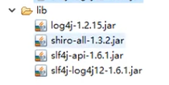

+ 以及shiro基本jar包
+ shiro官方范例在“shiro-source\shiro-root-1.2.6-source-release\shiro-root-1.2.6\samples”里面

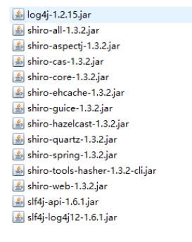

### 2，shiro的工作原理及流程

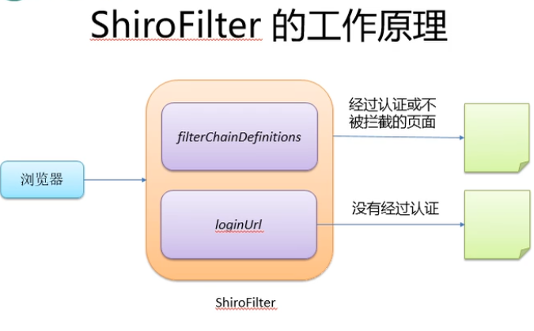

### 3，在web.xml里配置的的DelegatingFilterProxy注意事项

<filter-name>必须和spring.xml里的相关<bean>对象名字一致，因为他要到Spring的IOC容器里找

```xml
<filter>
    <filter-name>shiroFilter</filter-name>
    <filter-class>org.spring....DelegatingFilterProxy</filter-class>
</filter>
```

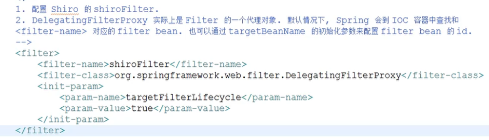

### 4，shiro配置细节

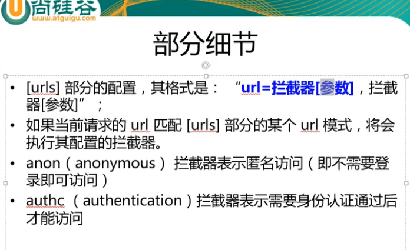

### 5，shiro采取第一次匹配优先的方式

大概意思

如果list.jsp = anon 表示它可以匿名访问，在浏览器地址栏输入：.../list.jsp可以访问到该页面，而不会跳转到loginl.jsp。但是如果把list.jsp移动到/** = authc下面，则不可访问了，因为它被/** = authc 覆盖了

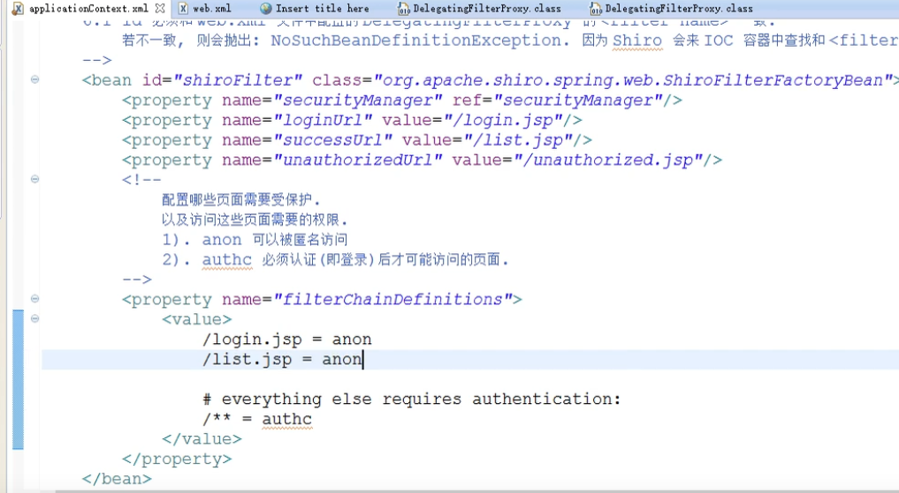

### 6，shiro架构

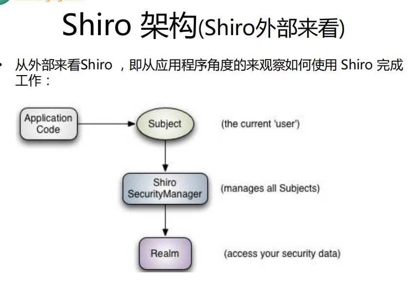

### 7,  shiro认证流程

1. 获取当前的 Subject. 调用 SecurityUtils.getSubject();
2. 测试当前的用户是否已经被认证. 即是否已经登录. 调用 Subject 的 isAuthenticated() 
3. 若没有被认证, 则把用户名和密码封装为 UsernamePasswordToken 对象
    1). 创建一个表单页面
    2). 把请求提交到 SpringMVC 的 Handler
    3). 获取用户名和密码. 
4. 执行登录: 调用 Subject 的 login(AuthenticationToken) 方法. 
5. 自定义 Realm 的方法, 从数据库中获取对应的记录, 返回给 Shiro.
    1). 实际上需要继承 org.apache.shiro.realm.AuthenticatingRealm 类
    2). 实现 doGetAuthenticationInfo(AuthenticationToken) 方法. 
6. 由 shiro 完成对密码的比对.

### 8，配置MD5

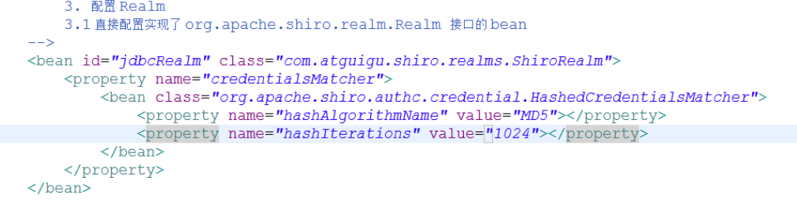


### 9,shiro的授权

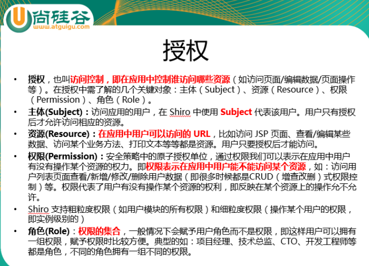

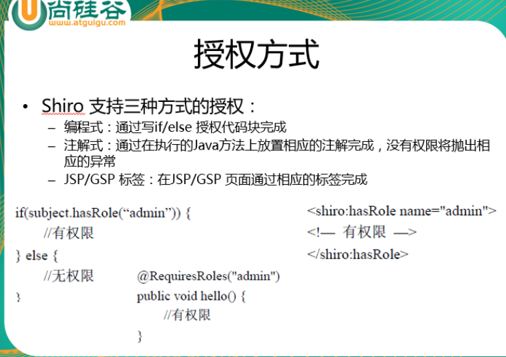

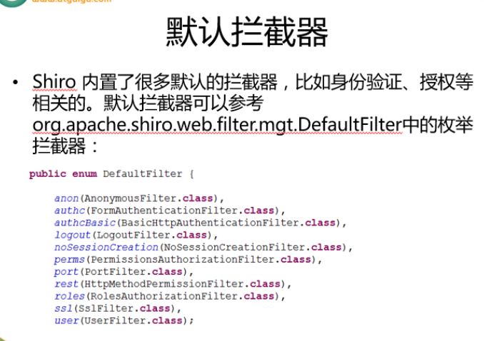

### 10，授权相关

1，授权所用的Realm需要继承AuthorizingRealm类，并实现其doAuthorizationInfo(..)方法，

​      而认证需要继承AuthenticatingRealm类，实现其doAuthenticationInfo(..)方法

2，因为AuthorizingRealm抽象类继承了AuthenticatinRealm抽象类，但没有完全实现其内的doAuthenticationInfo(..)方法

​     所以只需继承AuthorizingRealm，实现这两个方法即可，见个人代码中的ShiroRealm

### 11,  权限注解

注意事项：如果@Service层的方法上有事务注解@Transactional的话，不能中这些权限注解，会使service层对象成为代理的代理，发生类型转换异常，可把权限注解加载Controller层

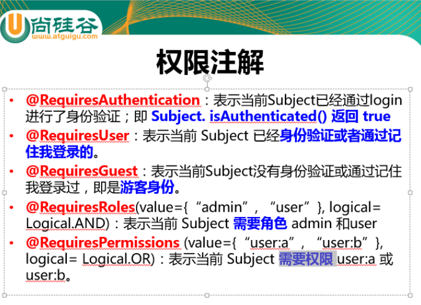

### 12，记住我和认证我的区别

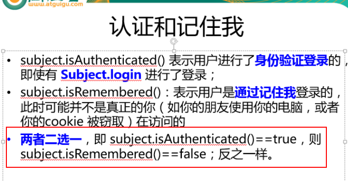

### 13，user属性用来设置记住我，认证我的都可以登录

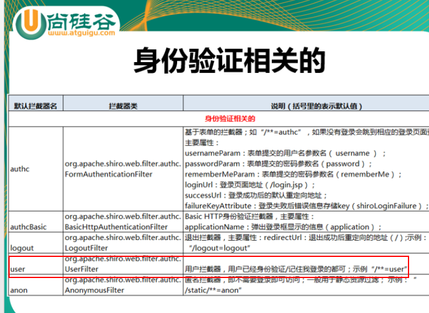

### 14，Shiro放开指定接口，不拦截

SpringBoot项目中找到Shiro配置类，在里面添加相应接口地址，不用写项目根路径，"anon"表示可匿名访问

```java
//若以框架返利
@Configuration
public class ShiroConfig {
	//放行小程序模块传送数据请求
    // Shiro过滤器配置
    @Bean
    public ShiroFilterFactoryBean shiroFilterFactoryBean(SecurityManager securityManager)  	   {
        filterChainDefinitionMap.put("/wh/warehousingOrder/saveOrderToWms", "anon");
    }
}
```

