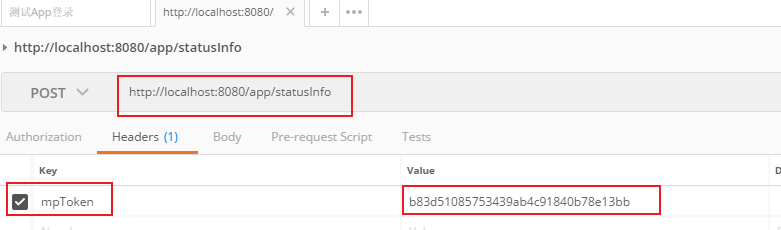
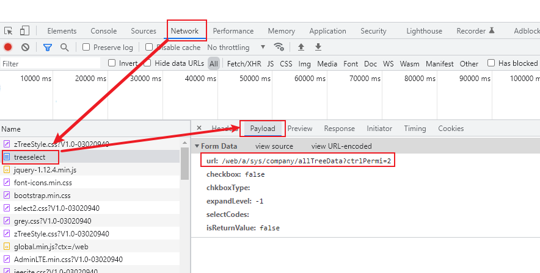
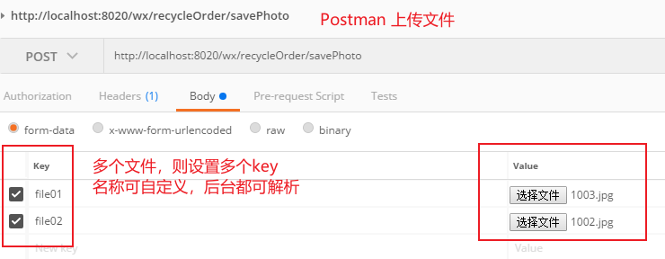
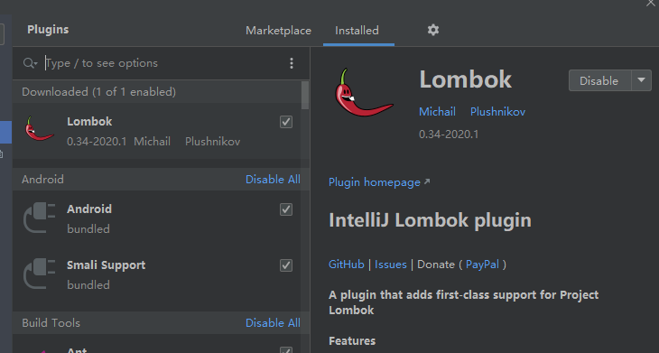
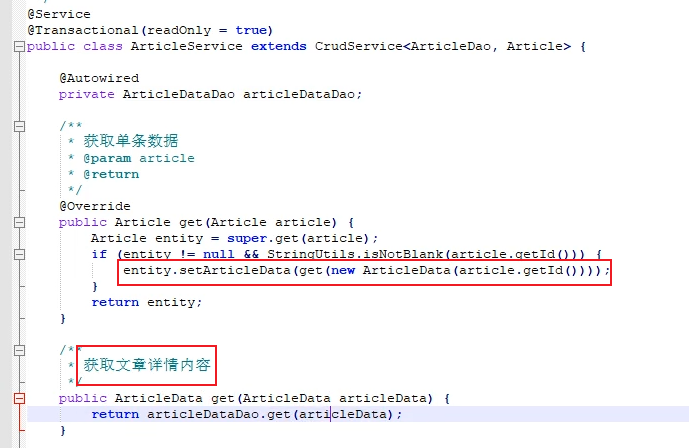
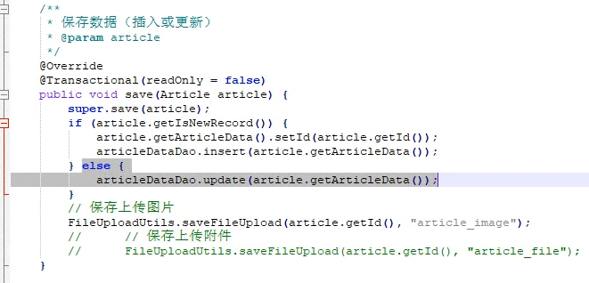

### 1，Tocmat中配置虚拟路径与真实路径映射，保存图片

web项目中一般不把上传的图片保存到数据库，也不保存到项目目录下，而是保存到本地磁盘下，然后设置url路径和本地磁盘路径的映射，在Tomcat的conf/server.xml文件中进行配置

```txt
首先找到tomcat目录下conf目录下的server.xml文件，在server.xml文件中找到<Host></Host>；
然后在其中加上这<Context path="/uploadfile" docBase="D:\File\images"></Context>

上面配置完成后，tomcat在的请求一般为：http://localhost:8080/uploadfile/abc.jpg。配置完重启之后，该请求自动跳转到物理路径D:\File\image下查找。会访问本机的D:\File\images\abc.jpg。
```

这样只需把数据库表中的，例如:path字段存储的相对路径值传到前端即可，前端把这个路径拼接到url上即可进行访问。**注意：这里设置的"Context path" 和application.yml里的不一样，访问图片是按照这个跟路径**

详见：工作个人笔记-2\项目笔记\tomcat配置虚拟路径上传文件、图片.docx  项目中图片的存储路径设置.docx 

后期写个例子验证

这样做的目的是减少数据库的容量，直接把图片保存到服务器的本地磁盘上了。

- **SpringBoot项目设置图片存储路径见本笔记 9**

### 2，煤电平台保存图片也是按照 1 中的方法

数据库vehicles_imgs里只是保存的相对路径，共前端的url拼接后访问的

```html
<!--静态页面的路径-->
</img>
访问路径：http://localhost:8080/profile/upload/2021/08/21/ac6d94dd-4740-42e5-93a9-bc9f3a0911b4.jpg
```

```java
//AppApiController.java里的上传图片方法 
private int uploadFiles(String foreignId,String serverType,String userId,List<MultipartFile> files){
        int num = 0;

        for(int i = 0 ; i < files.size() ; i++ ){
           try {
               String fileName = FileUploadUtils.upload(files.get(i));   //这里实际是真正上传图片到服务器
               VehiclesImgs vehiclesImgs = new VehiclesImgs();
               vehiclesImgs.setId(IdUtils.fastSimpleUUID());
               vehiclesImgs.setForeignId(foreignId);
               vehiclesImgs.setServerType(serverType);
               vehiclesImgs.setImgUrl(fileName);  //这里只是设置保存的相对路径，供前端访问用的
               vehiclesImgs.setCreateBy(userId);
               num += vehiclesImgsService.insertVehiclesImgs(vehiclesImgs);  //插入表内的只是路径字符串，并不是图片本身
           } catch (IOException e) {
               e.printStackTrace();
           }
       }

        return num;
    }
```

### 3, App端使用token认证的流程

(1)首先用户输入用户名密码验证通过后，会随机生成一个token, 它有个有效期，用户每次请求后端接口会在headers里带上这个token

详见：优车管postman登录app端步骤.docx

```java
//coal项目
@Controller
public class SysLoginController extends BaseController{
String token = IdUtils.fastSimpleUUID();
        user.setToken(token);
    return AjaxResult.success("登录成功",user);  //user含有token信息会传给前台
}    
```

(2)App端把后端传来的token保存到本地，每次请求就会带上这个token



(3)后端接收到这个token会在Filter里进行验证，对比与之前传过去的token是否相同，验证通过后才返回数据

```java
//coal项目
public class AppApiFilter  implements Filter {

    @Override
    public void doFilter(ServletRequest servletRequest, ServletResponse servletResponse, FilterChain filterChain) throws IOException, ServletException {

        HttpServletRequest httpRequest = (HttpServletRequest)servletRequest;
        HttpServletResponse httpResponse = (HttpServletResponse)servletResponse;

        String mpToken = httpRequest.getHeader("mpToken");

        if(StringUtils.isEmpty(mpToken)){
            httpResponse.getWriter().println(JSONObject.valueAsStr(AjaxResult.error()));
        }else {
            Object obj = JedisUtils.getObject(mpToken);
            if(null != obj){
                filterChain.doFilter(httpRequest, httpResponse);
            }else {
                httpResponse.getWriter().println(JSONObject.valueAsStr(AjaxResult.error()));
            }
        }

    }

```

### 4, @RequestMapping注解也可以获取application.yml里的注入

```java
@Controller
@RequestMapping(value = "${adminPath}")  //这里在yaml文件中注入值
public class LoginController extends BaseController {   }
```

### 5, 页面图片小图展示的做法

设置好css样式即可，后期点击放大在加事件即可。

```html
图片QQ</img>  <br><br>

   风景</img>
```

### 6, 查看前端请求的后端接口地址

一般headers里有，如果headers里不对，则在Payload里可查看到



### 7,优车管App中token的用法

首先用户登陆后，后台会根据用户名等信息从数据库中查出用户全部信息；

然后生成一个uuid作为token, 把token当作key,  用户信息对象user当作value存到redis里；

把token返回前端；

本次会话访问接口都带着token，查询数据时就从redis里获取对应用户，再查该用户的的其它信息；

代码见:  coal 项目的SysLoginController.java   AppApiController.java

### 8, 使用HttpServletRequest接收上传的文件，并保存



```java
  //11,保存
    @ResponseBody
    @RequestMapping("/saveOrder")
    public ResultModel savePhoto(HttpServletRequest request) {

        ResultModel result = new ResultModel("0","测试");

        //新建CommonsMultipartResolver
        CommonsMultipartResolver multipartResolver = new CommonsMultipartResolver(request.getSession().getServletContext());
        //上传文件地址
        String destPath = "E:\\localfile\\recycle";
        String imgPath = "";
        //判断请求里是否含有MultipartFile
        if (multipartResolver.isMultipart(request)) {
            //multiRequest是个Map,前端一个key对应一个multipart,传多个文件须有多个key, 名称不限，这里会自动解析
            MultipartHttpServletRequest multiRequest = (MultipartHttpServletRequest) request;
            Iterator<String> iter = multiRequest.getFileNames();
            //判断并保存到服务器本地
            while (iter.hasNext()) {
                MultipartFile multipartFile = multiRequest.getFile(iter.next());
                String dir = destPath + File.separator + multipartFile.getOriginalFilename();
                File file  = new File(dir);
                try {
                    multipartFile.transferTo(file);
                } catch (IOException e) {
                    e.printStackTrace();
                }
            }
        }
//        imgPath = imgPath.substring(0, imgPath.length() - 1);

        return result;
    }
```

### 9, SpringBoot项目设置访问图片路径映射

- **第一种方式：**

  编写一个WebMvcConfig类继承WebMvcConfigurerAdapter： 

addResourceHandler("/upload/**")配置的虚拟路径
 addResourceLocations(“file:D:/SchoolShop_IMG/upload/”);配置的映射路径 

注意：

1. file： 前缀不能丢。
2. 分隔符一定要用 / 。
3. 如果有配置server.servlet.context-path: /demo ，访问图片时一定要加上

```java
@Configuration
public class WebMvcConfig extends WebMvcConfigurerAdapter {
    @Autowired
    private FileUploadProperteis fileUploadProperteis;
    @Override
    public void addResourceHandlers(ResourceHandlerRegistry registry) {
        registry.addResourceHandler(fileUploadProperteis.getStaticAccessPath())
                .addResourceLocations("file:" + fileUploadProperteis.getUploadFolder() + "/");
    }

}
```

**注意：**上面设置后，原来SpringBoot项目默认设置resources目录静态路径static等都失效了，

需要在addResourceLocations(String ...)添加参数设置，使原先的static, public默认路径等还有效，因为它们里放着js,css等文件

```java
@Configuration
public class WebUrlMvcConfig extends WebMvcConfigurerAdapter {
    @Autowired
    private WebConfigProperties webConfigProperties;
    @Override
    public void addResourceHandlers(ResourceHandlerRegistry registry) {
        registry.addResourceHandler(webConfigProperties.getAccessPath())
                .addResourceLocations("file:" + webConfigProperties.getBaseDir() + "/" , "classpath:/static/","classpath:/public/");
    }
    //addResourceLocations(String ...),形参是可变参数，多个路径用逗号“，”隔开
}
```

- **第二种方式：再application.yml文件里设置**

https://blog.csdn.net/qq_31762741/article/details/121174900

```yml
# 应用服务 WEB 访问端口
server.port=8080
# 项目静态资源路径,可以不写默认为/**
# spring.mvc.static-path-pattern=/**
# 将项静态目资源路径映射到系统资源路径下
spring.resources.static-locations=file:H:\\AFile

====
spring.resources.static-locations=file:G:\\AFile,file:H:\\AFile

```

### 10, SpringBoot项目自定义配置类，出现异常

Web模块Application.java主启动类，启动报异常

异常名称：Error creating bean with name 'resourceHandlerMapping

代码：项目是SpringBoot多个模块

出错原因，这个个人手写配置类是给Weixin模块用的，但是开始放到了核心模块core里

解决办法：把这个自定义配置类放到Weixin模块即可

```java
//SpringBoot设置虚拟路径映射Tomcat磁盘路径
@Configuration
public class WebUrlMvcConfig extends WebMvcConfigurerAdapter {
    @Autowired
    private WebConfigProperties webConfigProperties;
    @Override
    public void addResourceHandlers(ResourceHandlerRegistry registry) {
        registry.addResourceHandler(webConfigProperties.getAccessPath())
                .addResourceLocations("file:" + webConfigProperties.getBaseDir() + "/");
    }
}
```

```yaml
file:
  enabled: true
  #url映射路径
  accessPath: /wxfiles/**
  #本地测试磁盘路径
  baseDir: E:\\localfile\\recycle
```

### 11,  idea使用maven可不设置Delegatge  IDE build/run  to Maven

执行 mvn  clean 以后 ，直接启动，反而可以自动编译，不用compile,  install了

### 12, \<packaging\>pom\</packaging\>的含义

一般在SpringBoot项目的根目录下的pom.xml里进行这样的设置

（1）打包成pom表示它生成的构件只是它本身， 没有代码需要测试或者编译，也没有资源需要处理。打包类型为POM的项目的默认目标 ；

（2） pom 项目里没有java代码，也不执行任何代码，只是为了聚合工程或传递依赖用的。

 （3） 配置<packaging>pom</packaging>的意思是使用maven分模块管理，都会有一个父级项目，pom文件一个重要的属性就是packaging（打包类型），一般来说所有的父级项目的packaging都为pom，packaging默认类型jar类型，如果不做配置，maven会将该项目打成jar包。  

### 13，Windows关闭端口号命令

netstat -ano | findstr 8080   ： 找到8080端口对应的进程9172

tasklist | findstr 9172 : 查看那个程序在用这个进程

taskkill -PID 9172 -F  ：终结进程9172

### 14,  SpringBoot手动开启事务代码范例

注意DataSourceTransactionManager的注解是@Resource

```java
@Service
public class YzDDateServiceImpl implements YzDDateService {

 
    @Resource
    private DataSourceTransactionManager transactionManager;
    
    DefaultTransactionDefinition def = new DefaultTransactionDefinition();
        def.setPropagationBehavior(TransactionDefinition.PROPAGATION_REQUIRED);
        TransactionStatus status = transactionManager.getTransaction(def);
  		transactionManager.commit(status);
    	transactionManager.rollBack(status);
```

### 15, 使用JSONObject把前台传来的json数组转为集合

使用的阿里巴巴的fastjson.JSONObject，此类中还有其它json字符串和java对象互转的方法

```java
    public Result<RecycleOrder> updateOrder(RecycleOrder recycleOrder,HttpServletRequest request){
        String subTypeAndPrice = request.getParameter("subTypeAndPrice");
        JSONObject jsonObject = new JSONObject();
        List<RecycleOrderCollection> rocList = jsonObject.parseArray(subTypeAndPrice,RecycleOrderCollection.class);
     
    }
```

### 16, Maven仓库设置冲突问题，pom.xml和settins.xml

如果pom.xml里设置了阿里云的远程仓库，那本地的 Maven—>conf/settings.xml里不要设置阿里云了，改为原来的默认仓库，且只写一个"<mirror>"；

### 17, idea项目修改代码，不必每次使用Maven  install解决方案

idea的Maven项目时，避免每次修改代码都得执行maven的install的解决方案

删除项目中的.idea文件，取消勾选idea中的 Maven -->Delegate IDE on maven，然后改代码后直接重启就行，修改会自动编译更新。

### 18, SpringBootApplication启动类的@MapperScan设置

```java
@ComponentScan("com.jeesite")
@ComponentScan("redis.clients.jedis")
 //如果xxxMapper.java在不同的包下，中间用"*",也可用“**”表示多重路径
@MapperScan("com.jeesite.modules.*.mapper") 
@SpringBootApplication
public class Application extends SpringBootServletInitializer {

}
```

### 19，项目使用lombok报假红，idea需下载lombok插件



### 20，前端请求头的格式

Content-Type :  application/x-www-form-urlencoded   : 表示请求是表单格式的，一般网页用这种。

Content-Type : application/json : 请求是json对象格式的，一般 app, 小程序等用这种格式，例：

```json
{
  "id": "e511a532298a4fa69413dc4c0353df90",
  "pageNo": 1,
  "pageSize": 2,
  "orderType": "1"
}
```

### 21，控制层接收JSON数据格式，使用注解@RequestBody,  @RestController

（1）单个方法接收json使用@RequestBody

```java
	@RequestMapping(value="/mySum",method = {RequestMethod.POST})
    @ResponseBody
    public RecycleSeller getMySum(@RequestBody RecycleSeller recycleSeller){
        return recycleSellerService.getMySum(recycleSeller);
    }
```

（2）设置整个控制层方法接收JSON数据格式，使用注解@RestController(=@Controller + @RequestBody)

```java
 @Target(value=TYPE)
 @Retention(value=RUNTIME)
 @Documented
 @Controller
 @ResponseBody
public @interface RestController
/**
 A convenience annotation that is itself annotated with @Controller and @ResponseBody.
Types that carry this annotation are treated as controllers where @RequestMapping methods assume @ResponseBody semantics by default.
*/
```

### 22，MyBatis存"if test=  updateTime !='' " 日期报错

错误：

```txt
Cause: java.lang.IllegalArgumentException: invalid comparison: java.util.Date and java.lang.String
```

原因：

```xml
<update id="updateTo" parameterType="RecycleUserOrder">
		UPDATE recycle_user_order
		<trim prefix="SET"  suffixOverrides=",">
			<if test="buyerId != null and buyerId != ''">
				buyer_id = #{buyerId},
			</if>
			<if test="userId != null and userId != ''">
				user_id = #{userId},
			</if>
 <!--这里“updateTime !=''”报错，MyBatis中日期类不能用空字符''判断，会把日期转成String,引起格式错误--> 
			<if test="updateTime != null and updateTime !='' "> 
				update_time = #{updateTime},
			</if>
		</trim>
		WHERE order_id = #{orderId}
	</update>
```

### 23，底层到上层

 电路学->模电->数电->汇编->操作系统 

算法常用的就十几种，不神秘，不高大上。

### 24，@MapperScan用法

在使用JeeSite框架时，须在启动类上加上@MapperScan注解，表明xxxDao.java所在的包，不加项目启动时扫描不到，出现“UnsatisfiedDependencyException”无法注入异常

```java
@SpringBootApplication
@MapperScan("com.jeesite.weixin.dao")
public class WeixinApplication extends SpringBootServletInitializer {
    public static void main(String[] args) {
        SpringApplication.run(WeixinApplication.class, args);
    }
    protected SpringApplicationBuilder configure(SpringApplicationBuilder builder) {
        this.setRegisterErrorPageFilter(false); // 错误页面有容器来处理，而不是SpringBoot
        return builder.sources(WeixinApplication.class);
    }
}
```

### 25，数据库表一对一的使用场景

例如，文章的ID放到一张表，文章的详情放到一张表，通过ID形成一对一，目的是减少负载；

如果文章ID和内容都放到一张表，展示的时候把ID和内容一起查出来，那么大量用户访问时会造成单表负载过大。两张表分开，第一张表显示文章的ID，标题，作者等概要信息，第二张表显示文章的详细内容，通过id形成一对一关联，可减少负载，优化查询。

同样的电商项目的商品列表和商品详情表也是用的一对一的关系

代码范例：

- 获取数据：



Article.java对应的是文章表，ArticleData.java对应的是文章详情表，它们的id是一样的，上面重写get方法，通过判断article_data详情表里是否有锁查询的article的id，有则调用  ArticleData  get(articleData)方法获取文章详情，并把articleData即文章内容赋值给Article.java里的articleData对象。

public Article get(Article  article)实际是查了两次数据库。

- 保存数据：在ArticleService.java里保存article之后，还要保存articleData文章内容



### 26，树状结构和节点对应表的对应关系

article表中的classify_id就是article_classify_tree表中的type_code

文章内容表：

```sql
CREATE TABLE `article` (
  `id` varchar(64) NOT NULL,
  `classify_id` varchar(64) DEFAULT NULL COMMENT '分类id',
  `classify_name` varchar(255) DEFAULT NULL COMMENT '分类名称',
  `title` varchar(255) DEFAULT NULL COMMENT '文章标题',
  `author` varchar(64) DEFAULT NULL COMMENT '作者',
  `author_head_pic` varchar(255) DEFAULT NULL COMMENT '作者头像',
  `href` varchar(255) DEFAULT NULL COMMENT '外部链接',
  `image` varchar(1000) DEFAULT NULL COMMENT '列表图片',
  `remark` varchar(1000) DEFAULT NULL COMMENT '列表简要描述',
  `content` longtext COMMENT '文章内容',
  `reference` varchar(100) DEFAULT NULL COMMENT '出处',
  `disease` varchar(20) DEFAULT NULL COMMENT '病种',
  `source` varchar(20) DEFAULT NULL COMMENT '来源（转载/原创）',
  `hits` varchar(64) DEFAULT NULL COMMENT '点击数',
  `hits_plus` varchar(64) DEFAULT NULL COMMENT '点赞数',
  `word_count` varchar(255) DEFAULT NULL COMMENT '文章字数',
  `status` varchar(1) DEFAULT NULL COMMENT '状态（0正常 1删除 2 停用 3冻结 4 待审 5驳回 9草稿 )',
  `create_by` varchar(64) DEFAULT NULL COMMENT '创建者',
  `create_date` datetime DEFAULT NULL COMMENT '创建时间',
  `update_by` varchar(64) DEFAULT NULL COMMENT '更新者',
  `update_date` datetime DEFAULT NULL COMMENT '更新时间',
  `user_code` varchar(64) DEFAULT NULL COMMENT '医馆账号编码',
  PRIMARY KEY (`id`) USING BTREE
) ENGINE=InnoDB DEFAULT CHARSET=utf8 ROW_FORMAT=DYNAMIC COMMENT='文章表';
```

树状表

```sql
CREATE TABLE `article_classify_tree` (
  `type_code` varchar(64) NOT NULL COMMENT '分类编号',
  `parent_code` varchar(64) DEFAULT NULL COMMENT '父级编号',
  `parent_codes` varchar(1000) DEFAULT NULL COMMENT '所有父级编号',
  `tree_sort` decimal(10,0) DEFAULT NULL COMMENT '本级排序号',
  `tree_sorts` varchar(1000) DEFAULT NULL COMMENT '所有级别排序号',
  `tree_leaf` char(1) DEFAULT NULL COMMENT '是否最末级',
  `tree_level` decimal(4,0) DEFAULT NULL COMMENT '层次级别',
  `tree_names` varchar(1000) DEFAULT NULL COMMENT '全节点名',
  `type_name` varchar(255) DEFAULT NULL COMMENT '分类名称',
  `image` varchar(255) DEFAULT NULL COMMENT '图片',
  `href` varchar(255) DEFAULT NULL COMMENT '链接',
  `status` varchar(10) DEFAULT NULL COMMENT '状态（0正常 1删除 2停用）',
  `create_by` varchar(64) DEFAULT NULL,
  `create_date` datetime DEFAULT NULL,
  `update_by` varchar(64) DEFAULT NULL,
  `update_date` datetime DEFAULT NULL,
  PRIMARY KEY (`type_code`) USING BTREE
) ENGINE=InnoDB DEFAULT CHARSET=utf8 ROW_FORMAT=DYNAMIC COMMENT='文章分类树状表';
```

### 27，云服务器设置开放端口

主机系统设置好后，注意在网页阿里云账户里也要开放端口

### 28，MD5摘要算法详解

1. 什么是摘要算法MD5？

   摘要算法又称哈希算法、散列算法。它通过一个函数，把任意长度的数据转换为一个长度固定的数据串（通常用16进制的字符串表示）； 

2. 用途：

   (1)用户名，密码加密，把密码通过MD5摘要算法算出一个32位的16进制数字存到数据库里，避免了存储明文密码的安全问题，相同密码使用MD5的摘要算法生成的值是一样的，因此为了防止破解，就给密码加个“盐值”，即使相同的密码，加上不同的盐值算出的结果也是不同的，一般使用用户名作为盐值；

   (2)用户校验文件是否被更改，项目保存文件和上传图片等时用，

    如果文件的md5值相同则这个文件就是相同的，防止保存重复图片，浪费内存空间。

   ```txt
   例如，hello.txt里写的是hello  world!  by  Tom，如果在Linux系统中，可执行命令
   md5sum  hello.txt  ： 算出这个文件的MD5值
   如果文件内容修改，改为 hello world! by Jerry
   md5sum  hello.txt  : 算出的MD5值是不同的，可检验出文件做了修改
   ```

例，百度网盘中的极速上传实际并没有把本地的文件上传上去，而是校验文件MD5，发现服务器有相同文件，仅仅把用户业务表中某个key和百度的管理文件的表的key做了下关联，使得用户的网盘里显示有这个文件。

参考：https://www.liaoxuefeng.com/wiki/1016959663602400/1017686752491744

### 29，对象放到HashMap里注意事项

处理数据量较大时，切记一定要重写hashCode()和equals()方法，否则会造成内存泄漏。

### 30，查询数据注意问题

查询数据时，要把所有的情况都考虑到，例，飞鹿会员系统查询会员，非会员的代码/getErCode31

### 31，统计时间段内扫码次数做法

在员工被扫码的时候，记录下扫码时间，被扫码员工id，即提前记录好，准备好记录。

### 32，序列化，反序列化的含义

##### **序列化的定义**

**序列化：**把对象转化为可传输的字节序列过程称为序列化。

**反序列化：**把字节序列还原为对象的过程称为反序列化。

##### **为什么要序列化？**

如果光看定义我想你很难一下子理解序列化的意义，那么我们可以从另一个角度来推导出什么是序列化, 那么究竟序列化的目的是什么？

其实序列化最终的目的是为了对象可以**跨平台存储，和进行网络传输**。而我们进行跨平台存储和网络传输的方式就是IO，而我们的IO支持的数据格式就是字节数组。

因为我们单方面的只把对象转成字节数组还不行，因为没有规则的字节数组我们是没办法把对象的本来面目还原回来的，所以我们必须在把对象转成字节数组的时候就制定一种规则**（序列化）**，那么我们从IO流里面读出数据的时候再以这种规则把对象还原回来**（反序列化）。**

如果我们要把一栋房子从一个地方运输到另一个地方去，**序列化**就是我把房子拆成一个个的砖块放到车子里，然后留下一张房子原来结构的图纸，**反序列化**就是我们把房子运输到了目的地以后，根据图纸把一块块砖头还原成房子原来面目的过程。

### 33，Maven下载依赖失败的解决办法

如果项目中用不到这个包，找到这个依赖直接删掉

### 34，如何判断MySql保存或修改数据成功？

保存方法或修改方法有返回值……基本知识……

### 35，递归使用注意事项

如果用一个实例变量自增控制递归，这个自增语句要写在调用递归方法之前，切记！

```java
if("200".equals(jsonObject.getString("status"))){
            return AjaxResult.success("success");
        }else if (updateCount < 3){  //失败后3次尝试
            ++ updateCount;  //这里要写在updateOrder(..)之前，否则递归无穷
            updateOrder(recycleOrder);
        }
```

### 36，Servelt的FilterChain

javax.servlet 包中提供了一个 FilterChain 接口，该接口由容器实现。容器将其实例对象作为参数传入 Filter 对象的  doFilter() 方法中。Filter 对象可以使用 FilterChain 对象调用链中下一个 Filter 的 doFilter()  方法，若该 Filter 是链中最后一个过滤器，则调用目标资源的 service() 方法。FilterChain 接口中只有一个方法，如下表。

| 返回值类型 | 方法                                                       | 描述                                                         |
| ---------- | ---------------------------------------------------------- | ------------------------------------------------------------ |
| void       | doFilter(ServletRequest request ,ServletResponse response) | 使用该方法可以调用过滤器链中的下一个 Filter 的 doFilter() 方法，若该 Filter 是链中最后一个过滤器，则调用目标资源的 service() 方法。 |

>  在 Filter.doFilter() 方法中调用 FilterChain.doFilter() 方法的语句前后增加某些程序代码，就可以在 Servlet 进行响应前后实现某些特殊功能，例如权限控制、过滤敏感词、设置统一编码格式等。

参考：http://c.biancheng.net/view/4031.html

http://c.biancheng.net/servlet2/filterchain.html


### 37，如果修改代码重启不管用解决办法

执行mvn clean，再重新编译，重启项目，一般重新加注解，或注解内参数改变使用此方法。正常代码块内的修改重启或重建即可。

### 38，DTO的含义及用法

DTO: data  transfer  object ，即传输数据的对象，一般项目中普通的java对象不一定用到所有属性，或者有的数据库对应的属性不想让外部看到，就用DTO来代替，在DTO中只需创建部分项目需求需要的几种属性即可。

例，OrderInfoDTO，在项目中可继承OrderInfo，

参考： https://blog.csdn.net/visant/article/details/53282322

这样带来的好处有：

1.依据现有的类代码，即可方便的构造出DTO对象，而无需重新进行分析。

2.减少请求次数，大大提高效率。

3.按需组织DTO对象，页面需要的字段我才组织，不需要的我不组织，可以避免传输整个表的字段，一定程度上提高了安全性。

结合个人的开发经验来谈一下用法：

​    一般我们使用DTO类来继承entity实体类，在DTO类里放一些业务字段，并提供get、set方法。当我们在业务逻辑层或者交互层用到一些数据库中不存在的字段时，我们就需要在DTO类里放这些字段，这些字段的意义就相当于一些经处理过的数据库字段，实质意义就是方便数据交互，提高效率。

### 39，微服务多模块项目修改后，重启修改的项目，不要弄错

例如upms模块修改了，注意不要启动mall模块，否则不管用

### 40，项目中的提示音功能

提示音文件的访问方法和访问图片一样，提供路径给前端就可以了

### 41，前端也可写定时任务

例如天宇的提示音功能，前端有定时任务，定时调用后端接口

### 42，String转为LocalDatetime

```java
DateTimeFormatter df = DateTimeFormatter.ofPattern("yyyy-MM-dd HH:mm:ss");
userInfo.setStartTime(LocalDateTime.parse(refereeUserV.getStartTime(),df) );
```

### 43，Linux和Windows的文件分隔符,换行符问题

**1）分隔符**

Linux  : 只支持 “/”

Windows:  Windows文件分隔符默认为"\"，由于是[转义符](https://so.csdn.net/so/search?q=转义符&spm=1001.2101.3001.7020)，通常开发中写为"\\"，注意，Windows也可以识别"/"分隔符 

**程序中上传图片时书写路径时注意！！**

```java
//范例，可用File.separator替代，这样就不会错了
result.add("fileupload"+File.separator +fileEntity.getFilePath() + File.separator + fileEntity.getFileId()+"."+fileEntity.getFileExtension());
```


**2）换行符**

CR(carriage return)回车 LF(line feed)换行

- Windows/Dos CRLF   \r\n     : \r表示Enter回车，\n表示下一行。
- Linux/Unix LF    \n
- MacOS CR     \r

java开发

Linux只能识别\n换行符，\r会被当做一个字符，而Windows下默认换行符为\r\n，但\n也可以。

所以当使用Java输出数据到文件中时**推荐使用\n**

```java
System.out.println("/r/n");   //windows
System.out.println("/n");   //Linux
```

参考：https://zhuanlan.zhihu.com/p/380574688	

### 45，修复的bug后一定要亲自验证

不要想当然认为是所想的错误原因，而不去验证。

### 46，异常无法定位时要打印堆栈

e.printStatckTrace()

如果没有try  catch则在报错的方法内加个大范围的try  catch(){e.printStatckTrace() ;}即可定位报错位置。

### 47，数据库跨项目同步数据注意事项

1）数据库同步完数据之后，记得在已同步的数据上打上已同步标记。例：“字段synchro = 1”

### 48，for循环判断累加注意事项

```java
BigDecimal goodsTotalPrice = new BigDecimal(0);
		boolean tagFlag = false;

		for(GoodsSpu spu : listGoodsSpu){
			String[] promotionId = spu.getPromotionId();
			if(promotionId != null &&  promotionId.length > 0){
				for(String str : promotionId){
					if(list.contains(str)){
						tagFlag = true;
					}
				}
			}
			if(tagFlag){
				goodsTotalPrice = goodsTotalPrice.add(spu.getPrice());
				tagFlag = false;  //加完符合标签的商品总价后，标志要复原为false进行下一次判断,否则一直是true
			}
		}
```

### 49，手机号正则表达式，Java代码

```java
String phoneNumber = "13355223377";
boolean flag = phoneNumber.matches("^1[3-9]\\d{9}$", phoneNumber);
```

### 50，养成写单元测试的习惯

CI/DI   DevOps等

