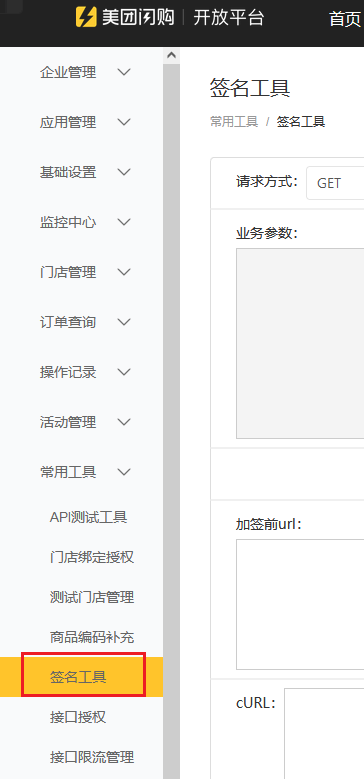
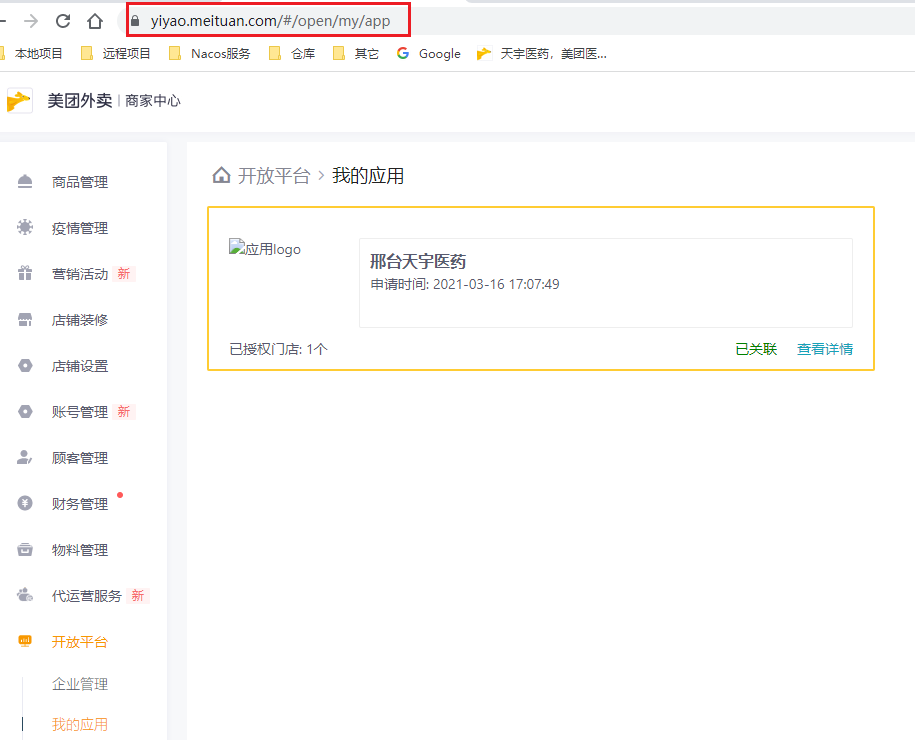
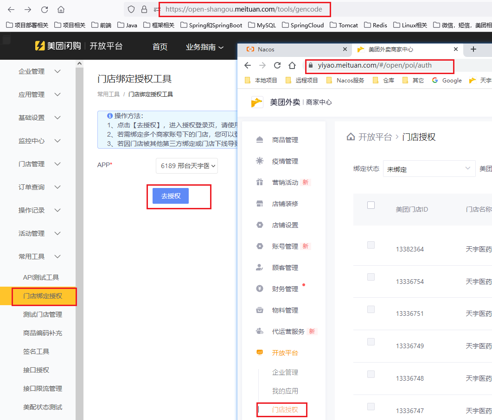

### 1，对接美团注意事项

**一，基本事项**

首先是公司，个人无法使用美团API，需要在美团开店，并注册开放平台。

1）美团开放平台指的是商品信息等，跟单独的美团配送平台不是一回事；

2）后台开发主要了解“自主研发者(品牌商)”，不是第三发开发者，后者是针对不动程序的用户的；

3）美团业务需要下载美团的sdk；

**二，美团回调本地接口注意事项**

1） 目前美团开放平台仅支持端口号为80或8080的回调地址。当回调端口修改时，系统推单和URL监控会立即生效。 

2）对中文字段，需要进行转义

3）美团回调接口传的参数，官方建议进行验签，有个sig字段就是传来的签名。


参考：https://blog.csdn.net/Pzzzz_wwy/article/details/117331556

### 2，美团官方的签名生成工具



### 3，接口对接注意事项

1）官方文档每个接口都有对应的范例

2）美团医药账户下的店，是实体店，可在美团闪购开放平台下进行绑定，这样以来美团闪购就可以统一管理商品库存信息了

**注意：闪购和医药不是相同的后台，需要进行绑定才可进行开发**

参考：https://open-shangou.meituan.com/home/guide/market/10680

- 首先美团医药关联我的应用

  

- 然后再闪购后台进行授权



2）闪购医药接口文档：https://opendj.meituan.com/home/docDetail/89

3）门店库存：在门店内售货架上的药品库存；

​	  门店仓库内库存：在门店的仓库里的药品库存，当门店的库存使用完时从仓库里补充；

 4）更新门店库存时的json参数medicine_data，用postman时不可换行，否则报错

```json
{
	"medicine_data":"[{\"app_medicine_code\":\"A001\",\"app_poi_code\":\"6189_2701260\",\"stock\":\"25\"},{\"app_medicine_code\":\"A004\",\"app_poi_code\":\"6189_2701260\",\"stock\":\"35\"},]"
}
```

5）签名验证Hutool工具使用：https://www.bookstack.cn/read/hutool-5.6.0-zh/f58585d24d7d7ba3.md