### 1，AWS使用教程

一，创建服务器：

1）登录账户之后，选择区域，每个区域均可创建服务器；

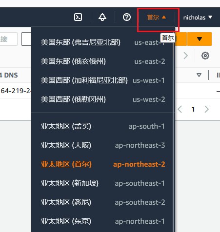

查看所有实例点击右侧“ECS全球视图”即可

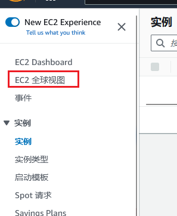

2）然后点击“启动实例”，选择号服务器类型，创建密钥对，使用putty链接的话选择.ppk。
密钥对的用途是可以免密登录服务器。使用的是公私钥机制，本地保存私钥，服务器默认会存上公钥。

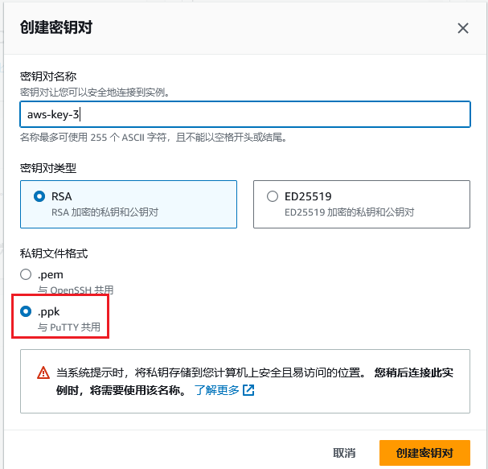

二，使用putty登录步骤：

- 打开实例操作面板，复制 公有 IPv4 DNS ，填入"Host Name"

  注意前面要加用户名，默认是ec2-user，例：ec2-user@ec2-15-164-219-249.ap-northeast-2.compute.amazonaws.com。

  用户名也可以自定义，具体见页面设置。

  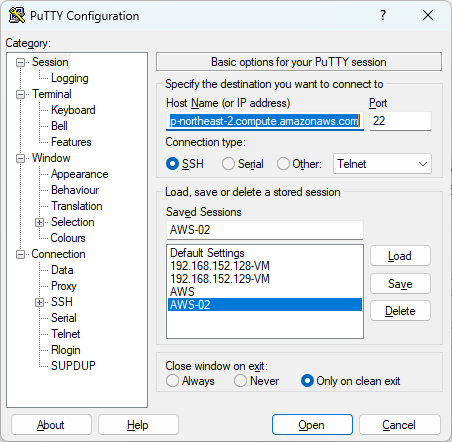

- Putty加载.ppk私钥，“SSH-->Auth : ..”注意加载完成后点击save保存，否则下次还得手动加载。

  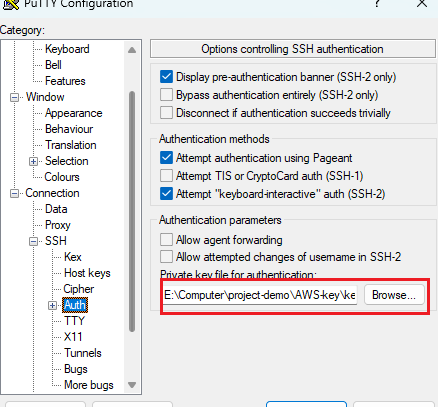

加载完成后保存设置，直接打开即可连接

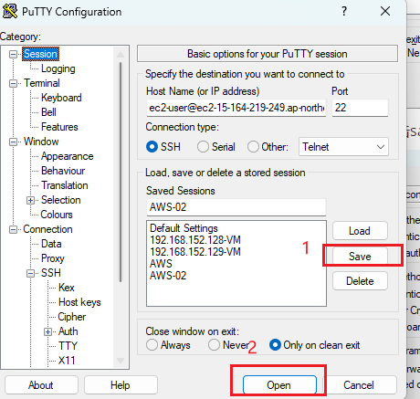

三，使用WinSCP登录:

参考：https://docs.aws.amazon.com/transfer/latest/userguide/transfer-file.html#winscp

1，新建登录框，把公有 IPv4 DNS复制到Host Name里，这里不用加ec2-user@，在下面user name里填

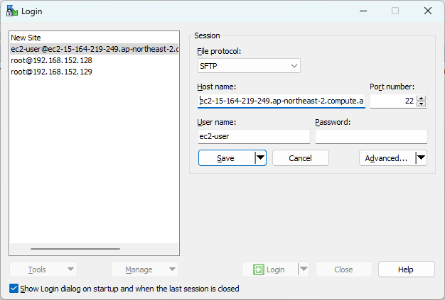

2，在这个界面设置私钥：选择Advanced-->Advanced-->SSH-->Authentication-->Private Key File找到私钥。

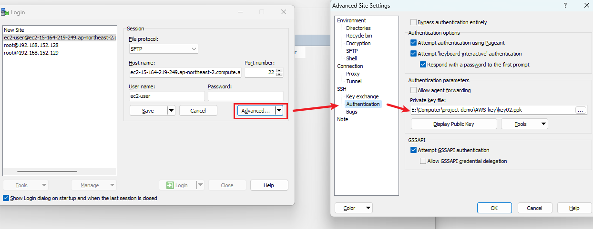

3，上面设置完成后，点击Ok，回主页面设置其它选项（优化大文件传输）,详见上方网页的官方解释。

3.1  Tools-->Preference-->Transfer-->Endurance-->勾选"Disable"

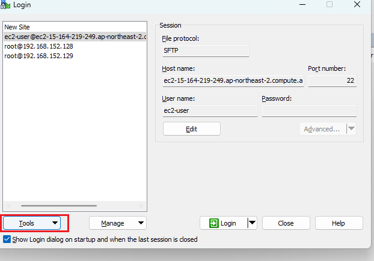

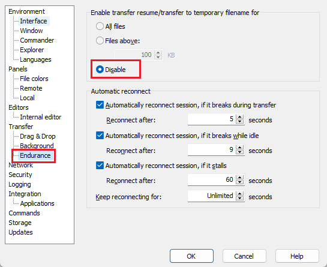

3.2  Background-->取消勾选“Use multiple connections for single transfer”

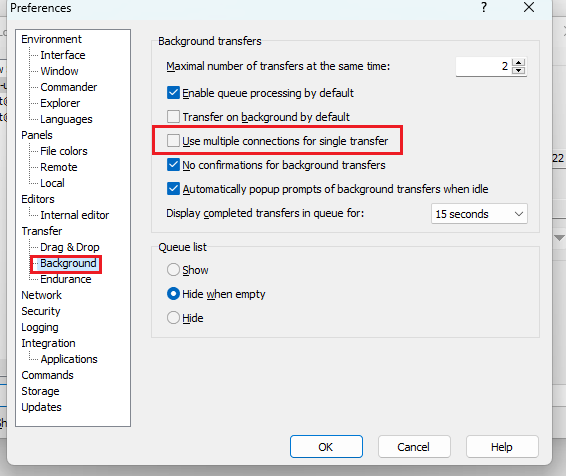