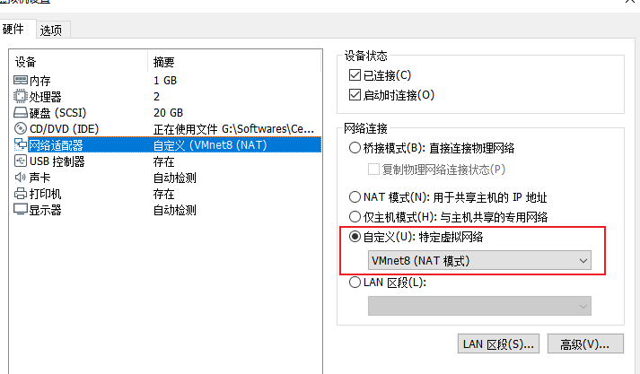
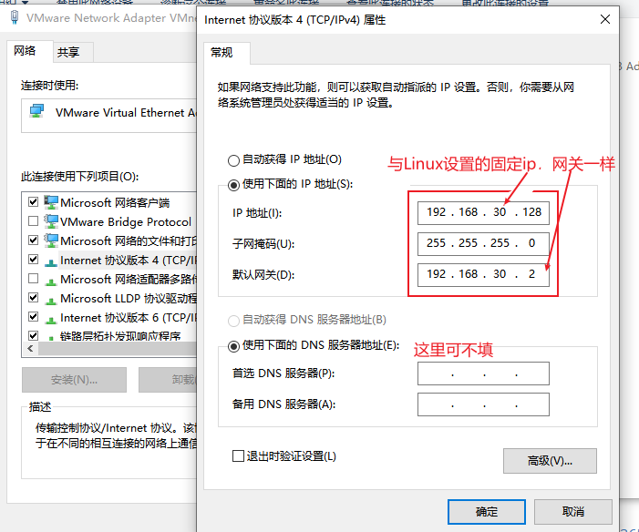

# 1，永久性配置Linux的IP地址

以ens33为例

linux查询网关 ：route

第一步：

ping  www.baidu.com ：查看是否连接

第二步：

ifconfig :  查看网卡信息，可以看到ens33没有ip地址（一般刚安装完Linux系统是没有ip地址的）

第三步：

dhclient :  让系统默认分配一个ip地址:例如是：192.168.139.129 ，**注意和宿主机的不一样，不要改为和宿主机的一样**

第四步：

vi  /etc/sysconfig/network-scripts/ifcfg-ens33  :  查看网络配置信息

修改以下信息

BOOTPROTO=static

ONBOOT=yes

再添加：

IPADDR=192.168.139.129      上面的dhclient的地址

NETMASK=255.255.255.0   子网掩码

GATEWAY=192.168.139.1     配置网关    //一般网关是....  .1，最后是1, 虚拟机里有时候自动生成的是 .2，要注意

DNS1=119.29.29.29    配置DNS服务器

第五步：

systemctl  restart  network.service

### 1，主机ping不通虚拟机

- 按照上面的设置好固定ip之后，还要把虚拟机的网络链接方式设置为vmnett8;

  

- 然后在主机电脑里找到vmnet8，设置vment8网卡的ip, 网关与linux系统一致即可

  

### 2，相关问题解决方案

主机能ping同Linux，而Linux不能ping同主机

主机的网络里不显示vmnet1和vmnet8图标

https://blog.csdn.net/linux2422988311/article/details/106578365

### 3,  win10不显示vmet8等图标

右击网络-->属性-->更改适配器设置，即可看到vmnet8

（如果以上设置不行）要启动设备网络服务，再按照上面设置一边，重启。参照同目录vmware开启网络服务教程

