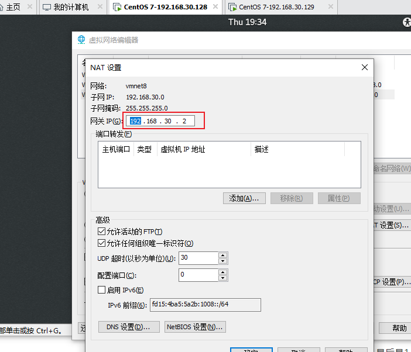

# 1，永久性配置Linux的IP地址

以ens33为例

linux查询网关 ：route

第一步：

dhclient :  让系统默认分配一个ip地址:例如是：192.168.139.129 ，**注意和宿主机的不一样，不要改为和宿主机的一样**

第二步：

ifconfig :  查看网卡信息，可以看到ens33没有ip地址（一般刚安装完Linux系统是没有ip地址的）

第三步：

ping  www.baidu.com ：查看是否连接

第四步：

vi  /etc/sysconfig/network-scripts/ifcfg-ens33  :  查看网络配置信息

修改以下信息

BOOTPROTO=static

ONBOOT=yes

再添加：

IPADDR=192.168.139.129      上面的dhclient的地址

NETMASK=255.255.255.0   子网掩码

GATEWAY=192.168.139.1     配置网关    //一般网关是....  .1，最后是1，虚拟机vmnet8有时是   2，具体看下图

DNS1=119.29.29.29    配置DNS服务器

第五步：

systemctl  restart  network.service

