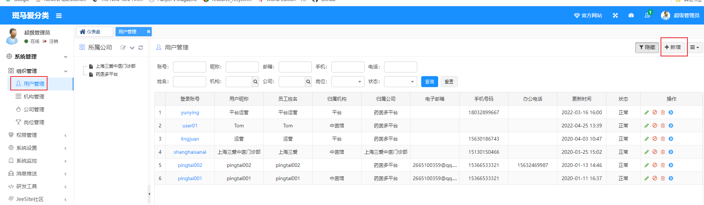
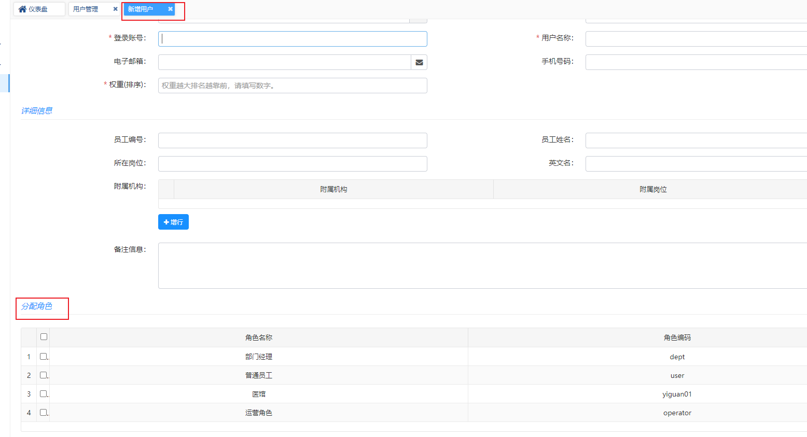

### 1，切面编程，拼接dataScope权限相关

参考文章：https://zhuanlan.zhihu.com/p/370700147

- 使用format(..)方法后，大括号会被后面的字符串依次替代,  "    @DataScope(deptAlias = "d")"  这里的"d"会被赋值到第一个大括号

```java
/* 格式化文本, {} 表示占位符<br>
     * 此方法只是简单将占位符 {} 按照顺序替换为参数<br>
     * 如果想输出 {} 使用 \\转义 { 即可，如果想输出 {} 之前的 \ 使用双转义符 \\\\ 即可<br>
     * 例：<br>
     * 通常使用：format("this is {} for {}", "a", "b") -> this is a for b<br>
     * 转义{}： format("this is \\{} for {}", "a", "b") -> this is \{} for a<br>
     * 转义\： format("this is \\\\{} for {}", "a", "b") -> this is \a for b<br>
    */
sqlString.append(StringUtils.format(
                        " OR {}.dept_id IN ( SELECT dept_id FROM sys_role_dept WHERE role_id = {} ) ", deptAlias,
                        (Long)map.get("roleId")));
```

- 用到了切面编程，使用注解切入，注意和路径切入对比

```java
(1)注解形式@annotation规定切入点
    @Pointcut("@annotation(com.zykj.common.annotation.DataScope)")   //注解切入，即@DataScope注解所在的方法就是切入点
    public void dataScopePointCut()
    {
    }
(2)路径形式规定切入点	//指定方法作为切入点
    @Pointcut(value="execution(* com.springframe.aop.*.*(..))")
	public void pointCut() {
	}
```

- 一，使用BaseEntity.java中dataScope属性的步骤 ,  因为BaseEntity.java是所有实体类的父类，所有实体类都有dataScope这个属性

  在VehiclesMaintenanceServiceImpl.java这个Service层的方法中规定好别名

  ```java
  @Override
      @DataScope(deptAlias = "d")
      public List<VehiclesMaintenance> selectVehiclesMaintenanceList(VehiclesMaintenance vehiclesMaintenance)
      {
          return vehiclesMaintenanceMapper.selectVehiclesMaintenanceList(vehiclesMaintenance);
      }
  ```

  二，在DataScopeAspect.java这个切面类里进行拼接

  ```java
  public class{
  	
      public static final String DATA_SCOPE = "dataScope";
      
      public static void dataScopeFilter(JoinPoint joinPoint, SysUser user, String deptAlias, String userAlias)
      {
          StringBuilder sqlString = new StringBuilder();
          List<SysRole> roles= user.getRoles();
          TreeMap<String, Object> map=null;
          for (int i = 0; i <roles.size() ; i++) {
  
              Object role=roles.get(i);
              try {
                  map= objToMap(role);
              } catch (IllegalAccessException e) {
                  e.printStackTrace();
              }
              String dataScope = (String) map.get("dataScope");
              //下面的if语句就是进行判断，判断当前用户的权限，如果是部门领导，就得出其部门下的所有数据，如果是单个员工，则只获取其名下数据，最后放到sql语句中拼接。“ OR ”最后被改成了" and "
              if (DATA_SCOPE_ALL.equals(dataScope))
              {
                  sqlString = new StringBuilder();
                  break;
              }
              else if (DATA_SCOPE_CUSTOM.equals(dataScope))
              {
                  sqlString.append(StringUtils.format(
                          " OR {}.dept_id IN ( SELECT dept_id FROM sys_role_dept WHERE role_id = {} ) ", deptAlias,
                          (Long)map.get("roleId")));
              }
              else if (DATA_SCOPE_DEPT.equals(dataScope))
              {
                  sqlString.append(StringUtils.format(" OR {}.dept_id = {} ", deptAlias, user.getDeptId()));
              }
              else if (DATA_SCOPE_DEPT_AND_CHILD.equals(dataScope))
              {
                  sqlString.append(StringUtils.format(
                          " OR {}.dept_id IN ( SELECT dept_id FROM sys_dept WHERE dept_id = {} or find_in_set( {} , ancestors ) )",
                          deptAlias, user.getDeptId(), user.getDeptId()));
              }
              else if (DATA_SCOPE_SELF.equals(dataScope))
              {
                  if (StringUtils.isNotBlank(userAlias))
                  {
                      sqlString.append(StringUtils.format(" OR {}.user_id = {} ", userAlias, user.getUserId()));
                  }
                  else
                  {
                      // 数据权限为仅本人且没有userAlias别名不查询任何数据
                      sqlString.append(" OR 1=0 ");
                  }
              }
          }
       //重点，最后拼成字符串给Map<String, Object> params中的一个键DATA_SCOPE赋值了
       if (StringUtils.isNotBlank(sqlString.toString()))
          {
              BaseEntity baseEntity = (BaseEntity) joinPoint.getArgs()[0];
              baseEntity.getParams().put(DATA_SCOPE, " AND (" + sqlString.substring(4) + ")");
          }
   
  }        
  ```

  三，切面类的操作最后目的就是给xxxMapper.java中对应方法的实体类形参“selectVehiclesMaintenanceList(VehiclesMaintenance vehiclesMaintenance)”

  中的params属性赋值，最后号sql语句中使用${params.dataScope}调用

  ```sql
      ……
      <if test="maintPeople != null  and maintPeople != ''"> and vm.maint_people like concat('%', #{maintPeople}, '%')</if>
  
              <!-- 在这里调用，进行数据范围过滤 -->
              ${params.dataScope}   
          </where>
          order by vm.start_time desc
  ```
  
  四，deptId的获取,  从ShiroUtils里获取用户登录信息，包含deptId
  
  ```java
  public class DataScopeAspect { 
  protected void handleDataScope(final JoinPoint joinPoint)
      {
          // 获得注解
          DataScope controllerDataScope = getAnnotationLog(joinPoint);
          if (controllerDataScope == null)
          {
              return;
          }
          // 获取当前的用户
          SysUser currentUser = ShiroUtils.getSysUser();   //从ShiroUtils里获取用户登录信息，包含deptId
          if (currentUser != null)
          {
              // 如果是超级管理员，则不过滤数据
              if (!currentUser.isAdmin())
              {
                  dataScopeFilter(joinPoint, currentUser, controllerDataScope.deptAlias(),
                          controllerDataScope.userAlias());
              }
          }
      }
  }    
  ```
  
  

### 2，RuoYi框架中的congtroller层只有一个return语句视图跳转的含义

工作流程是：前端前请求路径到/analyzeOil，在analyzeOil()方法里转发后是为了让Thymeleaf模板引擎解析

```java
@RequestMapping("/analyzeOil")
    public String analyzeOil()
    {
        return prefix + "/analyzeOil";   //这里是跳转到/resource/templates/../analyzeOil.html页面,供Themeleaf进行渲染的
    }

    @PostMapping("/analyzeOilList")    //然后在analyzeOil.html页面访问此接口，进行列表展示
    @ResponseBody
    public TableDataInfo analyzeOilList(LongMuckTask longMuckTask){
        startPage();
        if(null == longMuckTask.getDeptId()){
            longMuckTask.setDeptId(ShiroUtils.getSysUser().getDeptId());
        }
        List<LongMuckTask> list = longMuckTaskService.analyzeTaskList(longMuckTask);
        return getDataTable(list);
    }
```


### 3, JeeSite获取前端页面客户输入的用户名和密码的方式

JeeSite自带的FormAuthencationFilter.java继承了Shiro的同名类FormAuthenticationFilter，底层会调用这个Shrio同名类的executeLogin（）方法

```java
/**
 *JeeSite自带的
  表单验证（包含验证码）过滤类
 */
@Service
public class FormAuthenticationFilter extends org.apache.shiro.web.filter.authc.FormAuthenticationFilter {
	
protected AuthenticationToken createToken(ServletRequest request, ServletResponse response) {
    String username = getUsername(request);
		String password = getPassword(request);
		if (password==null){
			password = "";
		}
		boolean rememberMe = isRememberMe(request);
		String host = StringUtils.getRemoteAddr((HttpServletRequest)request);
		String captcha = getCaptcha(request);
		boolean mobile = isMobileLogin(request);
		return new UsernamePasswordToken(username, password.toCharArray(), rememberMe, host, captcha, mobile);   //这里创建一个token对象，把浏览器端传来的用户名密码封装到里面
    
	}
}
```

```java
//Shiro权限框架的源码
public abstract class AuthenticatingFilter extends AuthenticationFilter {
    public static final String PERMISSIVE = "permissive";

    public AuthenticatingFilter() {
    }

    protected boolean executeLogin(ServletRequest request, ServletResponse response) throws Exception {
        AuthenticationToken token = this.createToken(request, response);
        if (token == null) {
            String msg = "createToken method implementation returned null. A valid non-null AuthenticationToken must be created in order to execute a login attempt.";
            throw new IllegalStateException(msg);
        } else {
            try {
                Subject subject = this.getSubject(request, response);
                subject.login(token);   //这里
                return this.onLoginSuccess(token, subject, request, response);
            } catch (AuthenticationException var5) {
                return this.onLoginFailure(token, var5, request, response);
            }
        }
    }
```

### 4，JeeSite新增用户

JeeSite前台不开放注册，需要管理员添加；



分配相应角色，默认初始密码是123456，用户首次登陆后会提示修改；

