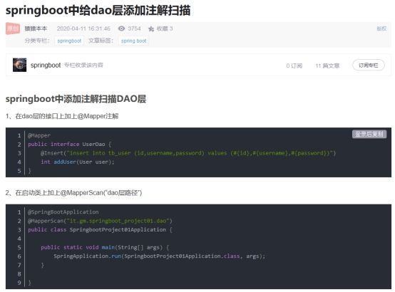

#### 1, Springboot的DAO层需加相关注解

注意启动类要加@MapperScan

 

**总结**@Mapper 一定要有，否则 Mybatis 找不到 mapper。 @Repository 可有可无，可以消去依赖注入的报错信息。 @MapperScan 可以替代 @Mapper。 @Component 和 @Repository 效果都是一样的，只是为了声明为bean

#### 2,  DOS窗口指定端口和项目访问根路径

| java   -jar    springboot004-1.0-SNAPSHOT.jar  --server.port=8088   --server.context-path=/list |
| ------------------------------------------------------------ |

这里设置的优先级高于配置文件的优先级

### 3,如果部署SpringBoot项目，自定义端口要记得Linux设置防火墙例外

   firewall-cmd --zone=public --add-port=8088/tcp --permanent
   firewall-cmd --reload
   firewall-cmd --zone=public --list-port

### 4, @ConfigurationProperties用法

除了和@Component联用以外，还可以和@Bean联用

```java
@Configuration
public class DruidConfig{
    @Bean
    @ConfigurationProperties("spring.datasource.druid.master")     //这个@ConfigurationProperties给形参druidPropertries注入值
    public DataSource masterDataSource(DruidProperties druidProperties){
        DruidDataSource dataSource = DruidDataSourceBuilder.create().build();
        return druidProperties.dataSource(dataSource);
    }
    /*注意下文的@ConditionalOnPropetries注解用法，
    havingVaule和name属性联用，当havingValue的值和name的值enabled对应的值相同时才加载配置，即havingValue="true", 配置文件中enabled="true" 
    参考：https://www.cnblogs.com/secbro/p/12011522.html
    */
    @Bean
    @ConfigurationProperties("spring.datasource.druid.slave")
    @ConditionalOnProperty(prefix = "spring.datasource.druid.slave", name = "enabled", havingValue = "true")
    public DataSource slaveDataSource(DruidProperties druidProperties)
    {
        DruidDataSource dataSource = DruidDataSourceBuilder.create().build();
        return druidProperties.dataSource(dataSource);
    }
    
}    
```

```yml
application-druid.yml配置文件 
slave:
                # 从数据源开关/默认关闭
                enabled: true
```

