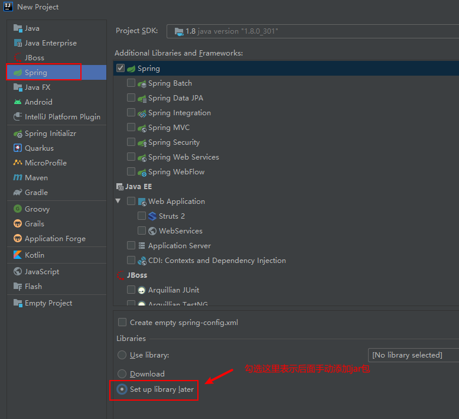
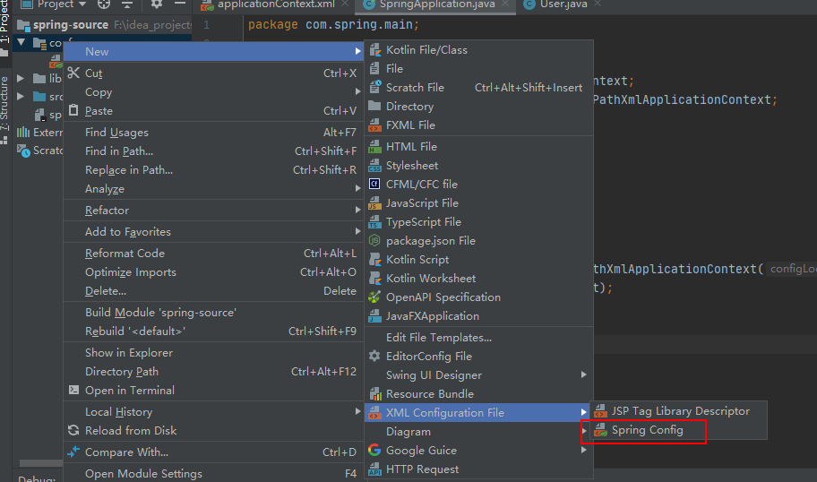

### idea手动新建Spring项目，不使用Maven

1，首先新建一个Spring项目

2，添加下载好的Spring框架的需要的jar和commons-logging-x.x.jar日志依赖包到lib目录，然后右击lib，选择Add as Library。

​	因为Spring框架默认使用这个日志插件，注意版本适配问题，例：SpringFramework 4.0 & commons-logging-	1.1.3.jar。

3，设置好conf为根目录，右击conf 选择“Mark Directory as --> Resource root”，然后在此目录下新建spring的xml配置文件。

​	注意，只有第二步“Add as Library”执行完成后，右击新建才会显示Spring的配置文件。

