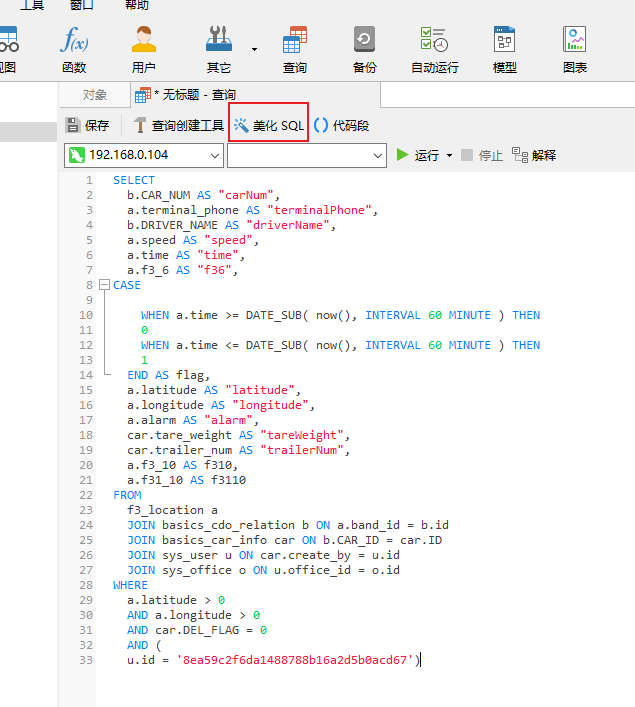
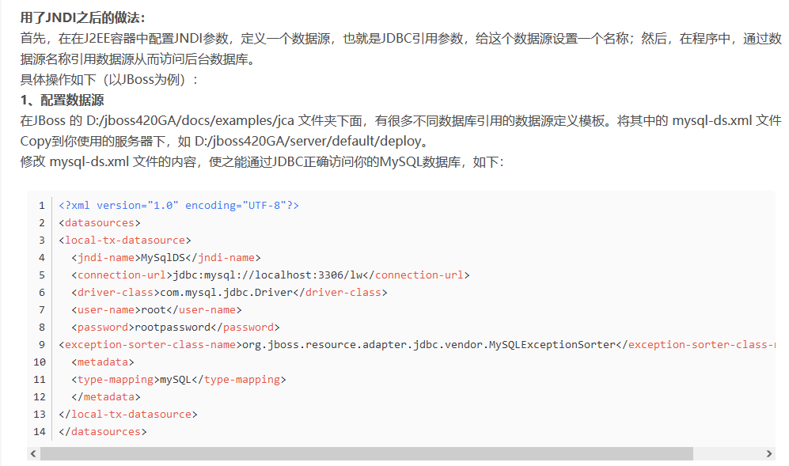

### 1，配置文件，以及启动项目步骤

项目新下载下来后，启动tomcat报NoClass异常，把lib内的jar包复制到WEB-INF下的lib里面


### 2，自动更新资源和字节码


### 3，@Transactional（readonly=true）加载类上后注意的情况

如果类中有删除，增加的方法要单独加@Transactional(readonly=false)，只读为真时，MySql不加锁，需设置为假防止数据重复错误    

### 4，SpringMVC的Controller层@ModelAttribute注解用法

这个注解在所有@RequestMapping的请求方法之前执行，可进行ModelAndView等相关操作

### 5,SSM项目中，在spirng.xml文件中配置定义xxxMapper.xml文件的路径范例

使用SqlSessionFactoryBean的属性mapperLocations来定义

```java
<!-- MyBatis begin -->
    <bean id="sqlSessionFactory" class="org.mybatis.spring.SqlSessionFactoryBean">
        <property name="dataSource" ref="dynamicDataSource"/>
        <property name="typeAliasesPackage" value="com.thinkgem.jeesite"/>
        <property name="typeAliasesSuperType" value="com.thinkgem.jeesite.common.persistence.BaseEntity"/>
        <property name="mapperLocations" value="classpath:/mappings/**/*.xml"/>   
		<property name="configLocation" value="classpath:/mybatis-config.xml"></property>
    </bean>
```

### 6，idea各个文件夹图标的含义


### 7，DynamicDataSource

```java
public String list(BasicsDriverInfo basicsDriverInfo, HttpServletRequest request, HttpServletResponse response, Model model) {
		DynamicDataSource.setCurrentLookupKey(DBNameUtil.dataSource1);  //动态切换数据源，即在spring.xml里有多个数据源可在这里进行切换使用
```

### 8，载重项目后台，查询在basicsDriverInfoService.findPage(..)里有dao层的方法

dao.findList(entity)执行查询并获取结果，封装在了在Page对象的list属性里

### 9，从数据库中查询用户，并设置权限范例

```java
public String list(BasicsDriverInfo basicsDriverInfo, HttpServletRequest request, HttpServletResponse response, Model model) {
		DynamicDataSource.setCurrentLookupKey(DBNameUtil.dataSource1);
		//以下即从表中查询用户，并确定其权限，从而决定显示哪些内容
        basicsDriverInfo.getSqlMap().put("dsf", BaseService.dataScopeFilter(basicsDriverInfo.getCurrentUser(), "o", "u")); 
		Page<BasicsDriverInfo> page = basicsDriverInfoService.findPage(new Page<BasicsDriverInfo>(request, response), basicsDriverInfo);  
		model.addAttribute("page", page);
		return "jeesite/obd/basicsDriverInfoList";
	}
```

```java
//dataScopeFilter(..)方法源码
public abstract class BaseService {
	protected Logger logger = LoggerFactory.getLogger(getClass());
	public static String dataScopeFilter(User user, String officeAlias, String userAlias) {
		StringBuilder sqlString = new StringBuilder();
		List<String> dataScope = Lists.newArrayList();
		if (!user.isAdmin()){
			boolean isDataScopeAll = false;
			for (Role r : user.getRoleList()){
				for (String oa : StringUtils.split(officeAlias, ",")){
					if (!dataScope.contains(r.getDataScope()) && StringUtils.isNotBlank(oa)){
						if (Role.DATA_SCOPE_ALL.equals(r.getDataScope())){
							isDataScopeAll = true;
						}
						else if (Role.DATA_SCOPE_COMPANY_AND_CHILD.equals(r.getDataScope())){
							sqlString.append(" OR " + oa + ".id = '" + user.getCompany().getId() + "'");
							sqlString.append(" OR " + oa + ".parent_ids LIKE '" + user.getCompany().getParentIds() + user.getCompany().getId() + ",%'");
						}
						else if (Role.DATA_SCOPE_COMPANY.equals(r.getDataScope())){
							sqlString.append(" OR " + oa + ".id = '" + user.getCompany().getId() + "'");

							sqlString.append(" OR (" + oa + ".parent_id = '" + user.getCompany().getId() + "' AND " + oa + ".type = '2')");
						}
						else if (Role.DATA_SCOPE_OFFICE_AND_CHILD.equals(r.getDataScope())){
							sqlString.append(" OR " + oa + ".id = '" + user.getOffice().getId() + "'");
							sqlString.append(" OR " + oa + ".parent_ids LIKE '" + user.getOffice().getParentIds() + user.getOffice().getId() + ",%'");
						}
						else if (Role.DATA_SCOPE_OFFICE.equals(r.getDataScope())){
							sqlString.append(" OR " + oa + ".id = '" + user.getOffice().getId() + "'");
						}
						else if (Role.DATA_SCOPE_CUSTOM.equals(r.getDataScope())){

							sqlString.append(" OR EXISTS (SELECT 1 FROM sys_role_office WHERE role_id = '" + r.getId() + "'");
							sqlString.append(" AND office_id = " + oa +".id)");
						}

						dataScope.add(r.getDataScope());
					}
				}
			}
```

### 10，JeeSite用户权限管理

1. 涉及权限的三张表之间是多对多关系：【用户】  <---多对多--->  【角色】  <---多对多--->  【菜单/权限】

2. 不同的登录用户权限不同，显示不同的列表以及相关功能，因此需要对用户身份进行识别，从而赋予相应的权限

注意：在调用 findList 或 findPage 之前去手动调用 addDataScopeFilter 方法，才可生效。例如：

```java
//JeeSite官方范例
@RequiresPermissions("user")
@RequestMapping(value = "listData")
@ResponseBody
public Page<EmpUser> listData(EmpUser empUser, HttpServletRequest request, HttpServletResponse response) {
	empUser.setPage(new Page<>(request, response));
	empUserService.addDataScopeFilter(empUser); 	// 调用数据权限过滤方法（重点）
	Page<EmpUser> page = empUserService.findPage(empUser);
	return page;
}

```

```java
//项目范例
@RequiresPermissions("obd:basicsDriverInfo:view")
	@RequestMapping(value = {"list", ""})
	public String list(BasicsDriverInfo basicsDriverInfo, HttpServletRequest request, HttpServletResponse response, Model model) {
		DynamicDataSource.setCurrentLookupKey(DBNameUtil.dataSource1);
		//这里进行登录用户判断，并进行sql语句拼接，然后传到xxxMapper.xml文件的sql语句中
        basicsDriverInfo.getSqlMap().put("dsf", BaseService.dataScopeFilter(basicsDriverInfo.getCurrentUser(), "o", "u")); 
        Page<BasicsDriverInfo> page = basicsDriverInfoService.findPage(new Page<BasicsDriverInfo>(request, response), basicsDriverInfo);
        model.addAttribute("page", page);
		return "jeesite/obd/basicsDriverInfoList";
	}
```


3. 上面获取到用户类型后，会把这个条件加在xxxMapper.xml中的sql语句的where后进行条件判断，从而得到不同的表格数据，进行展示

   ​	MyBatis Mapper 中调用如下两种方式：

   1. 采用 EXISTS 方式调用	： 将 `${sqlMap.dsf}` 放在 `Where` 后
   2. 采用 JOIN 方式调用	： 将 `${sqlMap.dsfFrom}` 放在 `From` 后 ，将 `${sqlMap.dsfWhere}` 放在 `Where` 后

   ```xml
   <if test="phoneNum != null and phoneNum != ''">
   				AND a.phone_num LIKE
   				<if test="dbName == 'oracle'">'%'||#{phoneNum}||'%'</if>
   				<if test="dbName == 'mssql'">'%'+#{phoneNum}+'%'</if>
   				<if test="dbName == 'mysql'">concat('%',#{phoneNum},'%')</if>
   			</if>
   		</where>
   		<!-- 数据范围过滤 -->
   		${sqlMap.dsf}    <!--在这里进行获取，并判断-->
   ```

4. Map  sqlMap里含有的就是用来判断是哪个用户的字符串，和映射文件xxxMapper.xml内的主sql语句进行拼接，最后得到一个特定的表进行显示

### 11，驾驶员添加下级菜单


### 12，MySQL添加索引范例

```sql
PRIMARY KEY (`id`) USING BTREE,
  KEY `sys_user_office_id` (`office_id`) USING BTREE,
  KEY `sys_user_login_name` (`login_name`) USING BTREE,
  KEY `sys_user_company_id` (`company_id`) USING BTREE,
  KEY `sys_user_update_date` (`update_date`) USING BTREE,
  KEY `sys_user_del_flag` (`del_flag`) USING BTREE
```

### 13，del_flag

del_flag为0时，可查到数据在浏览器显示

### 14，shiro权限控制jsp页面的删改查显示

如果给当前登录的用户设置了"obd:testBasicsPlan:edit"权限，则删改查的超链接会显示，可执行相关操作

```java
<shiro:hasPermission name="obd:testBasicsPlan:edit"><td>
    				<a href="${ctx}/obd/testBasicsPlan/form?id=${testBasicsPlan.id}">修改</a>
					<a href="${ctx}/obd/testBasicsPlan/delete?id=${testBasicsPlan.id}" onclick="return confirmx('确认要删除该测试设备2吗？', this.href)">删除</a>
				</td></shiro:hasPermission>
```

### 15，测试时jeesite.properties里改为本地数据库

注意更改jeesite.properties里的链接

### 16，sys_menu表里有权限相关设定


### 17，del_flag表示逻辑删除

在MySql表中设置一个del_flag字段，当为1时表示删除，为0时表示存在，实际表中并没有删除，只是变更这个字段的值

目的：防止误删，保存资料

弊端：当有个字段设置为unique时，再重复添加MySql会报重复错误

```xml
<!--代码范例-->
<where>
	a.del_flag = #{DEL_FLAG_NORMAL}   <!--首先判断是否逻辑删除-->
	<if test="driverName != null and driverName != ''">
		AND a.driver_name = #{driverName}
	</if>
	<if test="idNumber != null and idNumber != ''">
		AND a.id_number = #{idNumber}
	</if>
</where>
```

### 18，spring.xml里配置带有包路径的xxxMapper.xml文件的范例

```xml
<!-- MyBatis begin -->
    <bean id="sqlSessionFactory" class="org.mybatis.spring.SqlSessionFactoryBean">
        <property name="dataSource" ref="dynamicDataSource"/>
        <property name="typeAliasesPackage" value="com.thinkgem.jeesite"/>
        <property name="typeAliasesSuperType" value="com.thinkgem.jeesite.common.persistence.BaseEntity"/>
        <property name="mapperLocations" value="classpath:/mappings/**/*.xml"/>   <!--多重路径写法-->
		<property name="configLocation" value="classpath:/mybatis-config.xml"></property>
    </bean>
```

### 19，Spring框架定时器注解在jeesite模板中用法

注意@Service和@Lazy(false)注解都要加

```xml
spring.xml
<!-- 计划任务配置，用	@Service @Lazy(false)标注类，用@Scheduled(cron = "0 0 2 * * ?")标注方法 -->
	<task:executor id="executor" pool-size="10"/> <task:scheduler id="scheduler" pool-size="10"/>
	<task:annotation-driven scheduler="scheduler" executor="executor" proxy-target-class="true"/>
```

```java
//个人范例，TimerSchedule
@Service
@Lazy(false)
public class TimerSchedule {

    @Scheduled(fixedRate = 1000*2)
    public void getCarInfo(){
        System.out.println("schedule 定时器执行！")
    }
}
```

关于corn表达式

CRON表达式    含义 
"0 0 12 * * ?"    每天中午十二点触发 
"0 15 10 ? * *"    每天早上10：15触发 
"0 15 10 * * ?"    每天早上10：15触发 
"0 15 10 * * ? *"    每天早上10：15触发 
"0 15 10 * * ? 2005"    2005年的每天早上10：15触发 
"0 * 14 * * ?"    每天从下午2点开始到2点59分每分钟一次触发 
"0 0/5 14 * * ?"    每天从下午2点开始到2：55分结束每5分钟一次触发 
"0 0/5 14,18 * * ?"    每天的下午2点至2：55和6点至6点55分两个时间段内每5分钟一次触发 
"0 0-5 14 * * ?"    每天14:00至14:05每分钟一次触发 
"0 10,44 14 ? 3 WED"    三月的每周三的14：10和14：44触发 
"0 15 10 ? * MON-FRI"    每个周一、周二、周三、周四、周五的10：15触发 

### 20，项目打包相关

web项目打成war包，放到Tomcat的webapps里会自动解析

### 21，null和“”（空字符串）判断方法不同

null用双等号“==”判断:    "ABC" == null    

""用equals():   "".equals("ABC")

### 22，classpath: 和 classpath*:的区别

https://cloud.tencent.com/developer/article/1452740

classpath：只会到你的class路径中查找找文件。

classpath*：不仅包含class路径，还包括jar文件中（class路径）进行查找。

注意： 用classpath\*:需要遍历所有的classpath，所以加载速度是很慢的；因此，在规划的时候，应该尽可能规划好资源文件所在的路径，尽量避免使用classpath\*。

### 23，MyBatis中大于小于符号的转义"<, >, ="

mybatis 中 SQL 写在mapper.xml文件中，而xml解析 < 、>、<=、>= 时会出错，这时应该使用转义写法。

http://www.mybatis.cn/archives/754.html


### 24，Mysql-Jdbc配置zerodatetimebehavior=converttonull作用

**说明：*****JAVA**连接**MySQL**数据库，在操作值为0的timestamp类型时不能正确的处理，而是默认抛出一个异常，就是所见的：java.sql.SQLException: Cannot convert value '0000-00-00 00:00:00' from column 7 to TIMESTAMP。这一问题在官方文档中有详细说明，详见如下链接：http://bugs.mysql.com/bug.php?id=19274*

*http://dev.mysql.com/doc/refman/5.5/en/connector-j-installing-upgrading.html*

**JDBC**连接有一项属性：**zeroDateTimeBehavior** 可以用来配置出现这种情况时的处理策略，该属性有下列三个属性值：

exception（不指定，则默认）---->默认抛出异常

convertToNull------->转化为null

round------->替换成最近的日期即XXXX-01-01

因此对于这类异常，可以考虑通过修改连接串，附加zeroDateTimeBehavior=convertToNull属性的方式予以规避，例如：

jdbc:mysql://localhost:3306/mydbname?zeroDateTimeBehavior=convertToNull

　 　从另一个层面讲，这类异常的触发也与timestamp赋值的操作有关，如果能够在设计阶段和记录写入阶段做好逻辑判断，避免写入 '0000-00-00 00:00:00'这类值，那么也可以避免出现 Cannot convert value '0000-00-00 00:00:00' from column N to TIMESTAMP的错 误。

### 25，idea添加Tomcat的依赖

File -> project structure -> Modules -> 右侧Dependencies ->然后点加号把配置好的Tomcat的依赖包加进去

### 26，git 删除文件，或移动文件的提交办法

执行命令:  git  add -A   添加所有变更

后面使用git  commit -m  “version_00”提交就行了

### 27， MySQL快速删除表内所有数据方法

delete   from   t_user  :   不加任何条件即可，不加where

### 28，定时任务要打印起止日志信息

```java
protected Logger logger = LoggerFactory.getLogger(getClass());
public void task(){
    logger.info("==========添加静止时间任务开始==========");
    //......
    logger.info("==========添加静止时间任务结束==========");
}
```

### 29，项目中html，jsp，javascript更新后要刷新网页

否则无效

### 30,Maven项目启动报错解决方案

idea--->settings----->Build Tools --->Maven--->Runner:  有时候选上Deleagte IDE build tools to Maven 管用，有时候取消管用

### 31, Navicat美化整理SQL语句功能



### 32, 使用JNDI可切换不同数据库中的库，

不像以前那样只能写死访问一个库，

JNDI使java程序与数据库之间不再是紧耦合，解开了耦合



**项目范例**

```java
public class BasicsDriverInfoController {
    @RequiresPermissions("obd:basicsDriverInfo:view")
	@RequestMapping(value = {"list", ""})
	public String list(BasicsDriverInfo basicsDriverInfo, HttpServletRequest request, HttpServletResponse response, Model model) 	{
		DynamicDataSource.setCurrentLookupKey(DBNameUtil.dataSource1);   //动态切换数据源
		basicsDriverInfo.getSqlMap().put("dsf", BaseService.dataScopeFilter(basicsDriverInfo.getCurrentUser(), "o", "u"));
		Page<BasicsDriverInfo> page = basicsDriverInfoService.findPage(new Page<BasicsDriverInfo>(request, response), basicsDriverInfo);
		model.addAttribute("page", page);
		return "jeesite/obd/basicsDriverInfoList";
	}
}    
```

### 33，SpringMVC表单标签之 <form:select>标签用法

```java
public class RepeaterAccount extends DataEntity<RepeaterAccount> {
	
	private static final long serialVersionUID = 1L;
	private String loginName;		// 账号
	private String accountName;     //用户名
	private String receiveIp;		// 接收IP地址
	private String receivePort;		// 端口
	private Date startTime;		// 开始时间
	private Date endTime;		// 结束时间
```


```jsp

<form:select path="accountName" items="${raList}" itemValue="accountName" itemLabel="accountName">
</form:select>										
itemValue="accountName" ：相当于下面的${ra.accountName}，只是不用写单个对象ra了
itemLabel="accountName" : 赋值时对象的属性													
//以上相当于下面的下拉选项
<select name="ra.accountName">   <!-- 这里给RepeaterAccount象中的dept属性的accountName传值 -->
	<c:forEach items="${raList}"  var="ra">
	   <option value="${ra.accountName}"</option>   
    </c:forEach>					
</select> 
```

### 34，JavaScript的正则表达式使用注意事项

正则表达式的变量要在判断语句里声明，在外面错误，详见JavaScript个人代码：025-正则表达式验证邮箱格式第二例，增强版.html

```html
window.onload=function excute(){
			
			//错误位置
			//var regExp=/^\w+([-+.]\w+)*@\w+([-.]\w+)*\.\w+([-.]\w+)*$/g;   
			
			var emailObj=document.getElementById("emailAddr");
			var emailErrorSpan=document.getElementById("emailError");
			emailObj.onblur=function blurMethod(){   //这里使用onblur句柄，光标一离开就开始验证
			    
				var regExp=/^\w+([-+.]\w+)*@\w+([-.]\w+)*\.\w+([-.]\w+)*$/g;  //正则表达式必须放到句柄方法里面，否则无效，判断一直时错误
				var isOk=regExp.test(emailObj.value);                         //这句也要放到里面
				if(isOk){
					emailErrorSpan.innerHTML="邮箱格式正确";    
			    }else{
					emailErrorSpan.innerHTML="邮箱格式错误";
				}
			}
```


### 35, PageHelper.java分页工具类原理

实际底层是sql语句在起作用

select * from emp limit 0, 4 ：   显示第一页 每页显示4个，下标从0开始

select * from emp limit 4, 4 ：  显示第二页 每页显示4个，这里下标从4开始了，即从第五个数据开始显示，也显示4条

### 36, Map<User> 转换为Collection,  在转换为List的方法

```java
Map<User>  map = new HashMap<User>();
Collection<User>  collection = map.values();
List<User>  list = new ArrayList<User>(collection);  //必须使用ArrayList的有参构造，不可强转，否则报错
错误：List<User> list = (List<User>)collection;
```

### 37, hashCode(...)方法相关

Set集合判断对象是不是相同的方式是，两个对象的hashCode是否相同，然后再调用equals(..)方法判断，这俩条件都满足才是相同的对象。

### 38, 项目上线后，再次访问需清除本地缓存

防止还使用以前的缓存数据，没有展示最新效果
